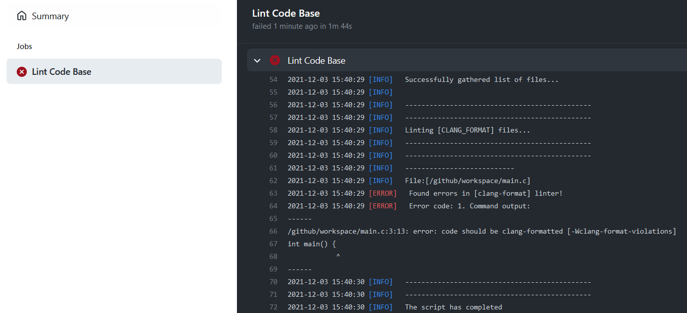
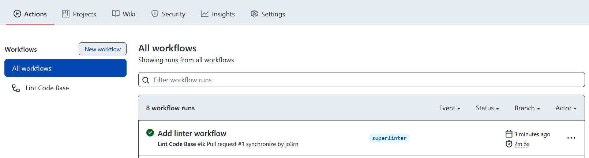

1. Erstelle ein neues lokales Repository. Sollte Dein erster Branch nicht `main` heißen, benenne ihn in `main` um.
1. Erstelle ein leeres `README.md` und committe es.
1. Erstelle einen neuen Branch `superlinter` und checke ihn aus. (`git checkout -b superlinter`)
1. Erstelle im Wurzelverzeichnis des Repos eine Datei mit dem Namen `.clang-format` (z.B. mit `touch .clang-format`)
1. Füge den Inhalt dieses Gists in die `.clang-format` Datei ein: <https://gist.github.com/jo3rn/946f3170d06b334b714e6ca937d2990f>

## Warum?

Mit der Datei `.clang-format` wird konfiguriert, welche [Style Options](https://clang.llvm.org/docs/ClangFormatStyleOptions.html) das Programm _Clang-Format_ auführen soll. _Clang-Format_ überprüft alle C-Dateien und verweist auf nicht eingehaltene Konventionen. Wenn _Clang-Format_ eine `.clang-format` Datei im aktuellen Verzeichnis oder einem Eltern-Verzeichnis findet, richtet es sich nach den dort festgesetzten Regeln. Beispiel: die Option `IndentWidth: 2` aus `.clang-format` besagt, dass eine Einrückung (`Indentation`), z.B. nach einer sich öffnenden geschweiften Klammer, aus 2 Leerzeichen bestehen soll.

Manche IDEs lassen sich so konfigurieren, dass _Clang-Format_ schon beim Programmieren auf Style-Probleme hinweist und/oder die Style-Probleme auf Knopfdruck korrigiert. Beispiel: [CLion aktiviert _Clang-Format_ automatisch, wenn es eine `.clang-format` Konfigurationsdatei vorfindet](https://www.jetbrains.com/help/clion/clangformat-as-alternative-formatter.html). Mit `Strg+Alt+L` formatiert die IDE dann den Code nach den vorgegebenen Regeln.

Man kann aber auch auf GitHub hochgeladene C-Dateien automatisiert via _Clang-Format_ überprüfen lassen. Dazu müssen wir zunächst folgende Schritte ausführen:

1. Erstelle im Wurzelverzeichnis des Repos einen Pfad `.github/workflows` und dort eine `linter.yml` Datei.
1. Füge den Inhalt dieses Gists in die `linter.yml` Datei ein: <https://gist.github.com/jo3rn/6da6f1ef6f268716b43fd924da1217ad>
1. Committe den bisherigen Stand.

## Was passiert nun?

Wenn GitHub die Datei `linter.yml` im Verzeichnis `.github/workflows` vorfindet, versucht GitHub eine _Action_ anhand der in `linter.yml` spezifizierten Anweisungen zu starten. In `linter.yml` steht, dass bei jedem Push auf einen beliebigen Branch und bei jedem Pull Request auf den `main` Branch eine Action ausgeführt werden soll. Welche Action das genau ist, steht weiter unten in der Datei, und zwar soll `github/super-linter@v4` ([Super-Linter](https://github.com/github/super-linter)) ausgeführt werden. Es soll also der Code auf Style-Richtlinien überprüft werden. In `linter.yml` wird das eingeschränkt auf C-Dateien. Dabei werden die Regeln aus der Datei `.clang-format` angewandt.

Aber Moment! Aktuell haben wir ja nur ein lokales Repository. Jetzt wird es Zeit, GitHub ins Spiel zu bringen.

1. Erstelle ein neues leeres Repository auf GitHub (ohne initial commit, ohne `README.md`)
1. Verknüpfe Dein lokales Repo mit dem eben erstellten remote Repo. (`git remote add origin remote-url`)
1. Pushe alle Deine Branches zu GitHub. (`git push -u --all`)

In Deinem GitHub Repo hast Du nun zwei Branches (`main` und `superlinter`). Auf `superlinter` ist auch schon der Linter konfiguriert. Was noch fehlt, ist eine C-Datei zum Überprüfen.

1. Schreibe ein HelloWorld Programm in eine `main.c` Datei.
1. Committe und pushe die Datei.
1. Gehe auf der Weboberfläche Deines GitHub-Repos auf den Reiter "Actions".

## Fast am Ziel!

Der Push auf den `superlinter` Branch triggert die Ausführung des Linters. Wenn bis hierhin alles nach Plan lief, solltest Du nach kurzer Zeit etwas Ähnliches sehen wie dies:


Das rote Kreuz links neben "Add linter workflow" zeigt an, dass der Linter nicht zufrieden ist. Ein grüner Haken hingegen würde anzeigen, dass der Linter nichts zu meckern hat. Hier wurde also irgendeine Style-Konvention missachtet. Bei einem Klick auf den Workflow und auf "Lint Code Base" werden weitere Details dazu angezeigt:



Aha! Die Ausgabe `error: code should be clang-formatted` signalisiert, dass in Zeile 3 der `main.c` Datei sich etwas nicht an die Regeln hält. Leider ist die Ausgabe sehr generisch und gibt nicht an, welche Regeln genau verletzt wird. In diesem Fall ist es eine Einrückung, die geradezurücken ist (pun intended). Wird die Korrektur committet und gepusht, ist der Linter im nächsten Durchlauf zufrieden:



Damit Euer Code stets sauber bleibt, solltet Ihr darauf achten, den Linter nie lange rot zu lassen.

Erstelle nun einen Pull Request vom `superlinter` Branch auf den `main` Branch. In der Pull Request Übersicht siehst Du, dass dabei auch der Linter startet. So können alle Beteiligten auf einen Blick sehen, ob sich die durch den Pull Request entstehenden Änderungen weiterhin an den festgelegten Code Style halten.

## Den Linter ausprobieren

Um Dir ganz sicher zu sein, dass der Linter funktioniert, solltest Du `main.c` zunächst so schreiben, dass der Linter grün wird.

```C
#include <stdio.h>

int `main`() {
  printf("Hello, World!\n");
  return 0;
}
```

Versuche jetzt den Linter gezielt herauszufordern, indem Du eine Regel aus `.clang-format` brichst. Committe und pushe den Regelbruch zu GitHub und sieh Dir die Linter-Ausgabe an. Mögliche Regelbrüche sind z.B.:

- mehr als 80 Zeichen in einer Zeile (ColumnLimit: 80)
- zu viel/wenig einrücken (IndentWidth: 2)
- sich öffnende geschweifte Klammer `{` in einer neuen Zeile (BreakBeforeBraces: Attach)
- ein Leerzeichen zwischen `!` und dem Operanden (SpaceAfterLogicalNot: false)
- inspiziere `.clang-format` und [die Dokumentation](https://clang.llvm.org/docs/ClangFormatStyleOptions.html) nach weiteren interessanten Regeln

Tipp: Um kurz zu testen, wie sich bestimmte Style Options auswirken, eignet sich dieses Tool: <https://zed0.co.uk/clang-format-configurator/>
