<style>
.highlight {
  color: red;
  font-weight: bold;
}
</style>

# Programmiermethoden und Programmierwerkzeuge

HS Fulda WS 2021/22

Jörn Auerbach
joern.auerbach@informatik.hs-fulda.de

---

## Kommt vorbei


---

## Woche 1


<!-- _backgroundColor: #f7eda8 -->

Orga, vim, VCS

---

## Organisation

---

## Hilfreich: Grundkenntnisse Terminal/Shell

z.B. via [YouTube Playlist Ready2Code Terminal/Shell Lektion](https://www.youtube.com/watch?v=03Z3-CssuUg&list=PLiisIVtqYuRuY8I9_V8TuUXZcUqhfs2Ge)

---

## Semesterplan (1/3)

|       | Vorlesung         | Übung                                 |
| ----- | ----------------- | ------------------------------------- |
| 10/21 | Orga, vim, VCS    | Lerntagebuch, vimtutor                |
| 10/28 | Git Grundlagen    | GitLab, SSH-Key, Repository           |
| 11/04 | Workflows mit Git | Merge, Pull Request                   |
| 11/11 | Git Sonstiges     | Gruppeneinteilung, Projekt-Diskussion |
| 11/18 | Shell Scripting   | bash                                  |

---

## Semesterplan (2/3)

|       | Vorlesung           | Übung                   |
| ----- | ------------------- | ----------------------- |
| 11/25 | Agile Entwicklung   | GitHub Team Repository  |
| 12/02 | Scrum               | Projekt Board           |
| 12/09 | DevOps              | GitHub Action (Linter)  |
| 12/16 | Reguläre Ausdrücke  | grep, sed, awk          |
| 01/13 | Debugging & Testing | Test Driven Development |

---

## Semesterplan (3/3)

|       | Vorlesung                       | Übung                 |
| ----- | ------------------------------- | --------------------- |
| 01/20 | Clean Code                      | Refactoring           |
| 01/27 | Rückfragen Projekt              | Rückfragen Projekt    |
| 02/03 | Open Source / Puffer (optional) | Projektpräsentationen |
| 02/10 | Open Source / Puffer (optional) | Projektpräsentationen |
| 02/17 | Preisverleihung                 | Projektpräsentationen |

---

## Qualifikationsziele

- IDE und Debugger
- **Versionskontrollsystem (Git)**
- Kommandozeile
- **Software-Entwicklungszyklus**
- Dokumentation
- **Team- und Projektarbeit**

---

## Bewertung / Prüfungsleistung

- 20% Lerntagebuch
- 80% Teamprojekt

Die Details auf den folgenden Folien nehmen viel vorweg, was wir uns erst im Laufe des Semesters erarbeiten. Es dient zunächst nur dazu, die Anforderungen klar zu machen.

---

### Lerntagebuch Inhalt

1. Was waren die wesentlichen Inhalte? (stichpunktartig)
2. Was kann ich für das Teamprojekt anwenden? (2-3 Sätze)
3. Einen Begriff/Ein Thema in eigenen Worten erklären (2-3 Sätze)
4. Optional: Was möchte ich den Dozierenden mitteilen?
   - Verbesserungsvorschläge, Gefühle, Kritik, Lob (0-2 Sätze)

---

### Lerntagebuch Format

- [Markdown-Datei](https://www.markdownguide.org/basic-syntax/) (z.B. `README.md`)
- über die Konsole bearbeiten (z.B. vim, nano)
- Sprache **entweder** Deutsch oder Englisch
- verfügbar machen auf <https://gitlab.cs.hs-fulda.de>
  - _fdai0178_ & _fdai0209_ mit Rolle _Developer_ hinzufügen

Ein Beispiel Lerntagebuch:
<https://gitlab.cs.hs-fulda.de/fdai0178/lerntagebuch-beispiel>

---

### Lerntagebuch Bewertungskriterien

- jeder Eintrag startet mit **100%** (~2 Punkte)
- Abzüge:
  - -100% Abgabe (push) erst nach der nächsten Vorlesung
  - -50% Formatierung mit Markdown mangelhaft
  - -33.3% pro fehlender Antwort zu 1-3
  - -20% Rechtschreibung/Grammatik ungenügend
- pro Eintrag minimal 0 Punkte (keine Negativpunkte)

---

### Teamprojekt

- selbstorganisiert zusammenfinden (Forum, Campus,...)
- **4-5** Studierende pro Team (keine Ausnahmen!)
- Anmelden des Teams über Moodle bis **17.11.2021**

---

#### Teamprojekt: Programmieren

- Konsolenanwendung in Java oder C
  - z.B. Spiel, Quiz, Story, Animation,...
- fehlende Programmier-Erfahrung wirkt sich nicht negativ aus! Wählt Programm und Umfang anhand Eurer Kenntnisse. Wendet an, was Ihr in anderen Modulen lernt, z.B. in _Programmierung 1_.
- je Team ein Repository auf <https://github.com>
  - User _jo3rn_ und _franzibmnn_ hinzufügen
- zur Weihnachtspause wird es eine kleine "Feature-Anfrage" geben, die Ihr in das Projekt einbauen müsst

---

#### Teamprojekt: Organisieren

- 1x _Product Owner_ & 1x _Scrum Master_ (programmieren nicht!)
- 2x/3x _Developer_
- GitHub:
  - Product & Sprint Backlog (_Product Owner_)
  - Issues (_Product Owner_, _Developer_)
  - Pull Requests (_Developer_)
- zwei Sprints durchführen (_Scrum Master_)
  - Planning, Daily, Review, Retrospective

---

#### Teamprojekt: Präsentation

- am Ende des Semesters während der SU-/Übungszeit
  - Termine buchbar nach der Weihnachtspause
- in 10 Minuten z.B.:
  - Programm / Code vorstellen
  - Organisation und Arbeitsweise erläutern
  - Erkenntnisse und Gelerntes zusammenfassen
- danach 5 Minuten Rückfragen

---

#### Teamprojekt: Dokumentieren

- gesamter (ausführbarer) Code auf GitHub
- Sprint-Ziel
- Screenshot(s) Product & Sprint Backlogs (_Product Owner_)
  - Beginn des ersten Sprints
  - Beginn des zweiten Sprints
  - Ende des zweiten Sprints
- Ergebnisprotokoll Retrospective (_Scrum Master_)

---

#### Teamprojekt: Fair bleiben

- springt nach der Anmeldung nicht mehr aus banalem Grund ab
- unterstützt euch gegenseitig
- **eine nicht selbst erstellte Abgabe führt zu Nichtbestehen!**
  - kleine Code-Schnipsel, einzelne Algorithmen etc. sind unter Angabe der Quelle (z.B. stackoverflow-Link) erlaubt

---

### Notenschlüssel

| ab ... Punkten | Note |
| -------------- | ---- |
| 0              | 5    |
| 50             | 4    |
| 55             | 3.7  |
| 60             | 3.3  |
| 65             | 3    |
| ..             | ..   |
| 90             | 1.3  |
| 95             | 1    |

---

### Bonuspunkte?

| Punkte | Challenge (abzuschließen bis 26.01.2022)                                                                                                             |
| ------ | ---------------------------------------------------------------------------------------------------------------------------------------------------- |
| 2      | ein Programmier-Meme/Comic/etc. in der Übung präsentieren und erklären, warum das lustig ist (darf noch nicht gezeigt worden sein, max. 4 pro Übung) |
| 2      | einen **sinnvollen** Pull Request zu einem Open Source Projekt erstellen (Mail mit Link zum PR an mich)                                              |
| 1      | einen (auch sinnlosen) Pull Request zu diesem Veranstaltungs-Repository erstellen (+1 Punkt: falls gemergt)                                          |

---

## Organisation Ende

<!-- _backgroundColor: #f7eda8 -->

Ab hier geht's los.

---

## Version Control System (VCS)

[Wikipedia Versionsverwaltung](https://de.wikipedia.org/wiki/Versionsverwaltung) (zentral)

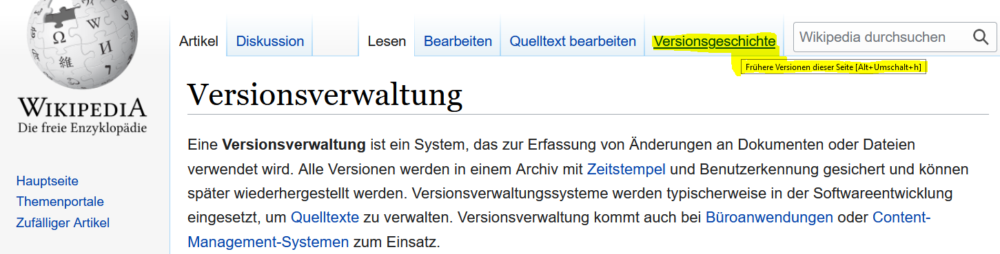

---

[Linux kernel](https://github.com/torvalds/linux) (dezentral)

nutzt Git als VCS

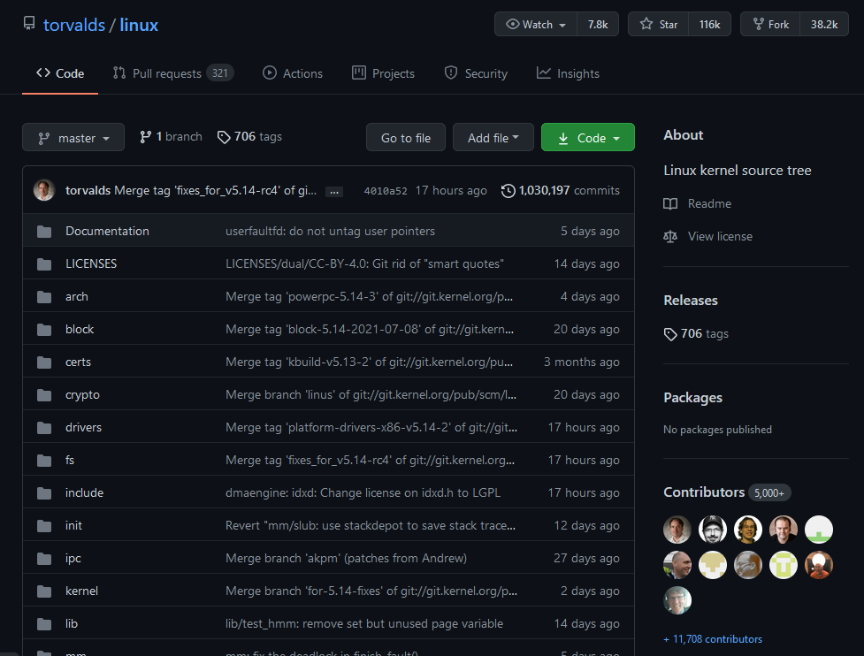

---

### Git: wichtige Funktionen

1. Protokollieren
   - was wurde wann von wem und wie geändert?
2. Absichern
   - einen protokollierten Stand wiederherstellen
3. Kollaborieren
   - dezentrale Datenhaltung
   - gleichzeitig bearbeiten und später zusammenführen

---

### Git: Erste Schritte (1/3)

[Download](https://git-scm.com) oder vorinstalliert `git --version`

Eigene Informationen festlegen:

```text
git config --global user.name "Vorname Nachname"
git config --global user.email vorname.nachname@informatik.hs-fulda.de
```

---

### Git: Erste Schritte (2/3)

Befehle um ein Lerntagebuch-Repository anzulegen:

- `mkdir Lerntagebuch && cd Lerntagebuch`
- `git init`
- `echo "# Woche 1" >> lerntagebuch.md`
- `vim links.md` (vim direkt mit `:wq` wieder verlassen)

Was zeigt `git status` an?
Was befindet sich im versteckten Verzeichnis `.git`?

---

### Git: Erste Schritte (3/3)

Untersuche nach jedem Befehl, wie sich die Ausgabe von `git status` verändert und was im `.git`-Verzeichnis passiert:

- `git add lerntagebuch.md`
- `git commit -m "Create lerntagebuch.md"`
- `git add links.md`
- `git commit -m "Create empty file for links"`

Was gibt `git log` am Ende aus?
Was soll das Ganze?

---

### Git: optionale Literatur

<!-- _backgroundColor: lightblue -->

- Pro Git Buch:
  <https://git-scm.com/book/en/v2> (Englisch)
  <https://git-scm.com/book/de/v2> (Deutsch)
  Für Woche 1: Kapitel 1 "Erste Schritte"
- <https://git-scm.com/docs>
  Git Dokumentation
- <https://itoshkov.github.io/git-tutorial.html>
  "Teach Yourself Git Without Learning a Single Git Command"

---

## vim

Wir kennen `ls`, `cd`, `mkdir`, etc.
Mit `vim` bearbeiten wir Dateien im Terminal über die Tastatur.

[Download](https://www.vim.org) oder vorinstalliert `vim --version`

[Dokumentation](https://vimhelp.org) oder `man vi`

vim öffnen: `vim`_`Dateiname`_

---

### vim: Normal Mode (1/2)

Standardmodus beim Start von vim

```text
Cursor bewegen:

h/l     links/rechts
j/k     runter/hoch
b/w     vorheriger/folgender Wortanfang
e       Wortende
0/$     Zeilenanfang/-ende
gg/G    Dateianfang/-ende
```

---

### vim: Normal Mode (2/2)

```text
rudimentäres Bearbeiten:

u       letzte Änderung rückgängig
r       Zeichen ersetzen
x       Zeichen löschen
yy      Zeile kopieren
dd      Zeile ausschneiden/löschen
p       nach dem Cursor einfügen
P       vor dem Cursor einfügen

Zahlen-Präfix für mehrfache Ausführung:

5j      5 Zeilen nach unten
4x      4 Zeichen löschen
3p      3 Mal einfügen
```

---

### vim: Insert Mode

zum Schreiben von Text

```text
von Normal Mode in Insert Mode wechseln:

i       an der Stelle des Cursors
I       am Zeilenanfang
a       eine Stelle nach dem Cursor
A       am Zeilenende
o       neue Zeile unter dem Cursor
O       neue Zeile über dem Cursor
```

Mit `Esc` zurück in Normal Mode

---

### vim: Command-Line Mode

Kommandos im Normal Mode mit `:` einleiten, `Enter` zum Bestätigen

```text
:w      speichern
:q      beenden
:q!     beenden und Änderungen verwerfen
:wq     speichern und beenden

Suchen:

:/Wort  Vorwärtssuche nach Wort
:?Wort  Rückwärtssuche nach Wort
n       nächster Treffer (während Suche)
```

---

### vim: Replace Mode

Vom Normal Mode mit `R` in Replace Mode: Text wird Zeichen für Zeichen ersetzt

Mit `Esc` zurück in Normal Mode

---

### vim: sonstige Ressourcen

<!-- _backgroundColor: lightblue -->

- `vimtutor` in der Shell eingeben
  ~30-minütiges Tutorial zusammen mit vim installiert
- <https://www.openvim.com>
  interaktives Tutorial
- <https://vim-adventures.com>
  spielerisch die Grundbefehle entdecken (nur erste Level kostenfrei)
- <https://www.vimgolf.com>
  (fortgeschrittene) vim Challenges

---

## Woche 2


<!-- _backgroundColor: #f7eda8 -->

Git Grundlagen

---

### 3 Zustände

Woher weiß Git, welche Dateien in einen Zwischenstand gehören?

```text
  +--------------+            +-----------------+             +------------+
  | Working Tree |            | Staging / Index |             |    .git    |
  +--------------+            +-----------------+             +------------+

  alle Dateien im             für die nächste                 in der Daten-
  aktuellen Verzeichnis:      Version vorgemerkt:             bank gesichert
  - modified                  - modified
  - unmodified                - tracked / staged
  - untracked

                    git add                       git commit
                --------------->               ---------------->
```

---

### `git status` unter der Lupe

| Ausgabe                  | Befehl   | beteiligte Bereiche     |
| ------------------------ | -------- | ----------------------- |
| `Untracked files`        |          | Working Tree            |
|                          | `add`    | Working Tree -> Staging |
| `Changes to be commited` |          | Staging                 |
|                          | `commit` | Staging -> Repository   |
| `nothing to commit`      |          | Repository              |

---

### Commit

- inhaltlich zusammengehörende Änderungen
- über einen Hash-Wert identifizierbar
- commit message: `git commit -m "kurze, aussagekräftige Beschreibung"`
  bei Bedarf weitere Zeilen mit Details
- add und commit in einem: `commit -a`

---

### Commit History

[git log](https://git-scm.com/docs/git-log) listet alle Commits.

Viele Optionen, um die Ausgabe anzupassen, z.B. `--oneline`:

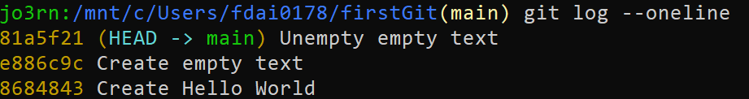

Organisationen/Teams sollten sich auf ein Commit Message Schema einigen, z.B. [Conventional Commits](https://www.conventionalcommits.org/).

---

### HEAD

`HEAD` zeigt auf den Punkt, an dem man sich gerade im Repository befindet:

- Branch (meistens)
- Commit (wenn man es herausfordert)

Speicherort: `.git/HEAD`

---

### detaillierte Inspektion

[git diff](https://git-scm.com/docs/git-diff) zeigt welche Änderungen genau vorgenommen wurden.

`git diff`: Änderungen zwischen Staging Area und **Working Tree** (allerdings nicht für neu hinzugefügte Dateien)

`git diff --staged`: Änderungen zwischen Staging Area und **Repository**

`git diff`_`oldCommit newCommit`_: Änderungen zwischen zwei Commits

---

### Git außerhalb des Terminals

Es gibt viele [GUI Clients](https://git-scm.com/downloads/guis) oder IDE-Integrationen für häufig auftretende Git-Arbeitsabläufe (add, commit, diff view, remote,...), z.B.:

- `gitk` in der Git Bash eingeben
- Git Integration von [VS Code](https://code.visualstudio.com)

Aber: die Grundkonzepte sollten auch ohne GUI verinnerlicht werden. Außerdem sind schicke Oberflächen wesentlich anfälliger für Veränderungen als Konsolenbefehle.

---

### Interactive Staging

Situation: viele bearbeitete Dateien im Working Tree sollen in mehrere Commits aufgeteilt werden

Mit `git add -i` die zu committenden Dateien fein justieren:

- `[u]pdate`: Datei stagen
- `[r]evert`: Datei unstagen
- `[p]atch`: einzelne Bereiche (hunks) einer Datei stagen

---

### .gitignore

Die `.gitignore`-Datei spezifiziert Dateien und Verzeichnisse, die Git ignorieren soll.

```gitignore
.DS_Store
/build/

server_log.txt

*.zip
```

`.gitignore`-Templates gibt's im Netz, z.B. für [C](https://github.com/github/gitignore/blob/master/C.gitignore) oder [Java](https://github.com/github/gitignore/blob/master/Java.gitignore)

---

### Tags

- ein Tag referenziert einen Commit
- zum Markieren von Release-Versionen, "Lesezeichen" o.ä.
- erstellen mit `git tag`_`Tagname`_, z.B. `git tag v1.0.0`
  - `git tag -a` (annotated Tag) sichert zusätzliche Metadaten
- alle auflisten mit `git tag`
- löschen mit `git tag -d`_`Tagname`_

---

### Messing with commits

`git revert`_`oldCommit`_ hebt die Änderungen aus _oldCommit_ auf, indem ein gegensätzlicher Commit hinzugefügt wird (ungefährlich)

`git commit --amend` ergänzt den letzten Commit (verändert Hash/Historie)

`git reset`_`oldCommit`_ setzt das Repository auf den Stand von _oldCommit_ zurück (mit `--hard` potentiell gefährlich: Verlust von Änderungen ohne Commit!)

`git rebase -i`_`oldCommit`_ ermöglicht verschiedene Operationen auf alle Commits nach _`oldCommit`_ (Löschen, Tauschen,...)

---

### git config

`git config --list` listet die aktuelle Konfiguration auf, z.B. die gesetzte Identität (`user.name` und `user.email`)

Auswahl an weiteren Konfigurationsmöglichkeiten:

- [Standard-Editor ändern](https://www.git-scm.com/book/tr/v2/Appendix-C%3A-Git-Commands-Setup-and-Config#_core_editor) (wer vim nicht mag)
- [Aliase vergeben](https://www.git-scm.com/book/tr/v2/Git-Basics-Git-Aliases), z.B. für kürzere Kommandos
- Farbschema ändern

---

### Lerntagebuch: GitLab Projekt anlegen

<!-- _backgroundColor: #c2f5a6 -->

- Login auf [https://gitlab.cs.hs-fulda.de/](https://gitlab.cs.hs-fulda.de/) mit fdNummer
- [SSH-Key erstellen und hinzufügen](https://docs.gitlab.com/ee/ssh/)
- neues Projekt `Lerntagebuch` anlegen
  - _fdai0178_ & _fdai0209_ mit Rolle _Developer_ hinzufügen

---

### Lerntagebuch: Remote hinzufügen

<!-- _backgroundColor: #c2f5a6 -->

Das zuvor erstellte **lokale** Repository verknüpfen wir nun mit dem **remote** Repository, um es für die Dozierenden verfügbar zu machen.

Im Verzeichnis eures lokalen Repos:

- `git remote add origin git@gitlab.cs.hs-fulda.de:fdNummer/lerntagebuch.git`
  (`fdNummer` und Projektnamen entsprechend anpassen)
- mit `git remote -v` prüfen, ob die `origin` gesetzt wurde
- mit `git push -u origin --all` das Lerntagebuch zu GitLab laden

---

### Git: origin

- `git fetch` liest alle Änderungen von `origin`
- `git pull` bringt alle Änderungen von `origin` ins lokale Repository
- `git push` sendet alle Änderungen zu `origin`

"origin" als Referenzname der `remote`-URL ist nur eine Konvention. Es können auch weitere (anders benannte) `remote`s hinzugefügt werden.

---

### Git Grundlagen: sonstige Ressourcen

<!-- _backgroundColor: lightblue -->

- <https://ndpsoftware.com/git-cheatsheet.html>
  Schema möglicher Aktionen zwischen den Git-Bereichen
- Pro Git Buch:
  <https://git-scm.com/book/en/v2> (Englisch)
  <https://git-scm.com/book/de/v2> (Deutsch)
  Für Woche 2: Kapitel 2 "Git Grundlagen"
- <https://tom.preston-werner.com/2009/05/19/the-git-parable.html>
  The Git Parable (Git mit einer Geschichte erklärt)

---

## Woche 3


<!-- _backgroundColor: #f7eda8 -->

<!-- _footer: '[Source](https://xkcd.com/1597/)' -->

Branching & Workflows mit Git

---

### Lerntagebuch: Markdown Formatierung

<!-- _backgroundColor: #c2f5a6 -->

|                            | :x:                                             | :white_check_mark:                                 |
| -------------------------- | ----------------------------------------------- | -------------------------------------------------- |
| Leerzeichen nach Symbol    | `#Überschrift`<br/>`1.Erstens`<br/>`-Stichwort` | `# Überschrift`<br/>`1. Erstens`<br/>`- Stichwort` |
| Backticks `` ` `` für Code | `git init`                                      | `` `git init` ``                                   |

Einrückungen haben eine Bedeutung. Nur gezielt einsetzen!

Achtet auf die korrekte Darstellung von Umlauten/Sonderzeichen!

weitere Doku: <https://www.markdownguide.org/basic-syntax/>

---

### Lerntagebuch: Inhalt

<!-- _backgroundColor: #c2f5a6 -->

- Eintrag für Woche 1 + 2 nicht vergessen!
- "2-3 Sätze" bedeutet: weniger als 2-3 Sätze gibt Abzug!
  (mehr ist immer möglich)
- Einträge aktiv selbst schreiben, nicht von irgendwo kopieren
- beginnend mit nächster SU (11.11.2021) müssen die Einträge immer **vor** der SU commitet und zu GitLab gepusht sein
  - d.h. für Woche 3 bis 11.11.2021 11:40 Uhr usw.

Ein Beispiel Lerntagebuch:
<https://gitlab.cs.hs-fulda.de/fdai0178/lerntagebuch-beispiel>

---

### Lerntagebuch: Missverständnisse

<!-- _backgroundColor: #c2f5a6 -->

1. > Git push wird dafür verwendet um die veränderten Dateien die sich im Staging befinden auf git hochzuladen.
2. > Öffnen über Git durch ... vim Name.md
3. > Der Befehl git diff zeigt [...] Änderungen zwischen dem Repository und dem Working Tree. Folglich wird das, was sich in dem Arbeitsverzeichnis befindet, mit dem, was sich in der Staging-Area befindet, verglichen.
4. > md: Wechselt den Location, jenachdem was für Ordner/File man eingibt. Mit md .. geht man auf 1 Location zurück

---

### Klonen


`git clone`_`repository`_ kopiert ein (remote) _`repository`_ in ein neues Verzeichnis.

`fetch`, `pull` und `push` stehen im geklonten Repository direkt zur Verfügung.

Beispiel:
`git clone git@gitlab.cs.hs-fulda.de:fdai0178/lerntagebuch-beispiel.git`

<!-- _footer: '[Bild-Quelle](https://pxhere.com/en/photo/1040881)' -->

---

### Branch

|                                 | Branch | HEAD | Tag |
| ------------------------------- | ------ | ---- | --- |
| "zeigt" auf einen Commit        | x      | x    | x   |
| wandert mit neuem Commit weiter | (x)    | x    |     |
| kann mehrere geben              | x      |      | x   |

- man commitet immer auf maximal einem Branch
  (bislang `main` bzw. `master`)
- Branch an der aktuellen Stelle erzeugen: `git branch`_`branchName`_
- auf anderen Branch wechseln: `git checkout`_`branchName`_

---

#### Warum Branches?

- Release / verschiedene Varianten
  - Long Term Support
  - Premium-Version
  - A/B-Test
  - Designs
- parallel Arbeiten ohne andere zu beeinträchtigen
  - (un)fertiges Feature
  - Bugfix

---

#### Merge

Situation: mehrere Varianten sollen zu einem Stand zusammengeführt werden

`git merge`_`branchName`_ holt die Commits aus _`branchName`_ in den aktuellen Branch.

---

##### Merge: Fast Forward

reibungsloser Merge durch "vorspulen"

```text
A --- B           (* main -> B)
       \
        C --- D   (feature -> D)
```

`git merge feature`

```text
A --- B --- C --- D   (* main -> D) (feature -> D)
```

---

##### Merge: 3-Way

```text
A --- B -- D -- F   (* main -> F)
       \
        C ----- E   (feature -> E)
```

`git merge feature` erzeugt neuen Commit `G`

```text
A --- B -- D -- F - G   (* main -> G)
       \           /
        C ----- E -     (feature -> E)
```

`G` hat zwei Vorgänger und vereinheitlicht die Änderungen der Commits `C`, `D`, `E` und `F`.

---

#### Merge Konflikte


Situation: eine Datei wurde auf mehreren Branches an der gleichen Stelle verändert

```text
# README.md
<<<<<< HEAD/main
main will das hier schreiben
======
feature will lieber das hier schreiben
>>>>>> feature
```

`git merge --abort` bricht Merge ab

---

#### Merge Konflikte lösen

Für jeden `<<< === >>>`-Block muss entschieden werden, wie er zusammengeführt werden kann.

```text
# README.md
main will das hier schreiben
feature fügt das hier an
```

Um den Merge abzuschließen wird die Datei nach dem Editieren wie gewohnt versioniert.
`git add README.md`
`git commit -m "Merge feature into main"`

---

#### Branch löschen

Nicht mehr benötigte Branches sollten gelöscht werden.

- `git branch -d`_`branchName`_: wenn Branch gemergt ist
- `git branch -D`_`branchName`_: wenn Branch noch nicht gemergt ist

---

#### Rebase (1/2)

```text
A --- B -- D -- F   (main -> F)
       \
        C1 ----- E1 (* feature -> E1)
```

`git rebase main`

```text
A --- B -- D -- F   (main -> F)
                 \
                  C2 ----- E2   (* feature -> E2)
```

---

#### Rebase (2/2)

- setzt den aktuellen Branch hinten dran
- verändert die Commits des aktuellen Branchs
  (im Beispiel: `C1`&`E1` wird zu `C2`&`E2`)
- wenn Merge Konflikte entstehen:
  - _`Konfliktdatei`_ öffnen, Konflikt lösen, Trennzeichen entfernen
  - `git add`_`Konfliktdatei`_
  - `git rebase --continue`
  - ...oder `git rebase --abort`

---

#### Pull Request

> Ich möchte diesen Branch in diesen anderen Branch mergen.

Vor dem Merge können sich andere Developer die Änderungen anschauen und Feedback geben.

| PR wird akzeptiert  | PR wird nicht akzeptiert |
| ------------------- | ------------------------ |
| Branch wird gemergt | TODOs sind entstanden    |

---

### Workflow: [Trunk Based Development](https://trunkbaseddevelopment.com/) (1/2)

`main` ist "trunk", in den direkt committet (z.B. `D`, `F`) oder kurzlebige `feature`-Branches gemergt werden.

```text
        (release1.0 -> B)       ---------- (release1.1 -> K)
       /                       /         /
A --- B -- D -- F - G -- H -- I -- J -- K -- L   (* main -> L)
       \           / \                      /
        B1 -- B2 --   G1 --- G2 --- G3 -- G4

              (feature1 -> B2)       (feature2 -> G4)
```

Releases sind Tags auf dem trunk-Branch (`release1.0`) oder abgespaltete `release`-Branches (`release1.1`) mit Hotfixes (`K`).

---

### Workflow: [Trunk Based Development](https://trunkbaseddevelopment.com/) (2/2)

- Developer:
  - `pull`en mehrmals täglich vom trunk
  - `push`en möglichst täglich in den trunk
- es kann zu (fast) jeder Zeit releast werden
- "never break the build"
  - Commits vor dem `push` testen / reviewen / pair-programmieren
  - falls dennoch kaputt: `revert`/`reset` (möglichst automatisiert)

---

### Workflow: [Feature-Branch](https://www.atlassian.com/git/tutorials/comparing-workflows/feature-branch-workflow) (1/2)

```text
A --- B --------- C ------------------------ D   (* main -> D)
      |\         /                       \  /
      | B1 --- B2  (cc-payment -> B2)     C1     (bugfix -> C1)
       \
        BA --- BB --- BC --- BD --- BE --- BF    (coupon-code -> BF)
```

- alle Änderungen werden auf einem dedizierten Branch entwickelt
- auf `main` wird nicht direkt committet, nur gemergt
- `main` hat immer funktionierenden Code (so die Hoffnung)
- wird in Verbindung mit Pull Requests auch [GitHub Flow](http://scottchacon.com/2011/08/31/github-flow.html) genannt

---

### Workflow: [Feature-Branch](https://www.atlassian.com/git/tutorials/comparing-workflows/feature-branch-workflow) (2/2)

`feature` Branches:

- fördern Reviews und Kollaboration durch Pull Requests
- isolieren Experimente, die auch mal schief gehen oder frühzeitig beendet werden können
- lassen erkennen, woran gerade gearbeitet wird

---

### Workflow: [GitFlow](https://nvie.com/posts/a-successful-git-branching-model/) (1/2)


- `master`: Release-History
- `develop`: `feature`s für nächstes Release
- `feature`: work in progress
- `release`: letzte Vorkehrungen vor Release
- `hotfix`: Behebung kritischer Fehler in bereits releaster Version

---

### Workflow: [GitFlow](https://nvie.com/posts/a-successful-git-branching-model/) (2/2)

- relativ komplexe Branch-Struktur
- explizite Regeln führen zu Sicherheit, aber auch Limitationen
- mehrere langlebige Branches müssen aktuell gehalten werden
- `develop` und `feature` entsprechen im Grunde dem Feature-Branch Workflow
- gut geeignet, wenn nur selten releast wird oder mehrere Releases parallel existieren

---

### "truth" Repository

- (Remote) Repository auf das alle Zugriff haben, z.B. auf GitHub
- alle `push`en regelmäßig, um ihre lokalen Commits allen zur Verfügung zu stellen (und als Backup)
- alle `pull`en regelmäßig, um die Änderungen der anderen zu prüfen und in ihre Arbeit zu integrieren

---

### Projekt: Workflow wählen

<!-- _backgroundColor: #c2f5a6 -->

Jeder Workflow hat Vor- und Nachteile.

Wichtig ist, dass sich die Developer in eurem Team auf einen Prozess einigen, mit dem sie sich wohl fühlen.

Ihr könnt auch einen der vorgestellten Workflows modifizieren oder einen anderen Weg gehen. Das solltet ihr in der Präsentation aber begründen können.

**Tipp**: einen simplen Workflow ausprobieren und nur bei Bedarf zu einem komplexeren wechseln.

---

### Workflows mit Git: sonstige Ressourcen

<!-- _backgroundColor: lightblue -->

- Pro Git Buch:
  <https://git-scm.com/book/en/v2> (Englisch)
  <https://git-scm.com/book/de/v2> (Deutsch)
  Für Woche 3: Kapitel 3 "Git Branching" & Kapitel 5.1, 5.2

- <https://learngitbranching.js.org>
  interaktives Git Tutorial mit Visualisierungen

- <https://xosh.org/explain-git-in-simple-words/>
  "How to explain git in simple words?"

---

## Woche 4


<!-- _backgroundColor: #f7eda8 -->

Git Sonstiges

---

### Lerntagebuch: Missverständnisse (Woche 3)

<!-- _backgroundColor: #c2f5a6 -->

1. > Es können pro 'merge' immer nur zwei Branches zusammengeführt werden.
2. > HEAD = ist der "Branch" auf dem man sich gerade befindet
3. > Falls Fehler aufgetreten sind, kann man mit dem Interactive Staging Commits umstagen und korrigieren.

---

### Zwischenspeichern

`git stash` lagert Dateien aus Index und getrackte Dateien aus Working Tree in einen "Stash" aus.

Stash zurück holen mit

- `stash pop`: löscht diesen Stash
- `stash apply`: belässt den Stash in `stash list`

---

### Datei sezieren

- `git blame`_`file`_ zeigt die Commits an, durch die der aktuelle Zustand von _`file`_ entstanden ist.

```text
$ git blame README.md
16497eb4 (alice 2015-01-11 13:43:02 -0800  1) # How to authenticate via SSH
16497eb4 (alice 2015-01-11 13:43:02 -0800  2)
aab42501 (bob   2015-01-12 00:08:51 +0100  3) ## Prerequisites
59b51cde (alice 2015-01-11 15:09:44 -0800  4) 1. You need an SSH key pair.
```

- `git log -p --follow`_`file`_ zeigt alle Commits, die das File verändert haben.

---

### weitere Kleinigkeiten

- `git show`_`commit`_ zeigt die Änderungen, die durch _`commit`_ entstanden sind.
- `git rm`_`file`_ löscht _`file`_ und staged die Löschung.
- `git mv`_`oldFile`_ _`newFile`_ verschiebt / benennt um und staged die Änderung.

---

### Rosinenpicken

`git cherry-pick`_`commit`_ hängt _`commit`_ an den aktuellen Branch an.

Working Tree muss clean sein.

Auch hier können Konflikte entstehen:

- `git add` -> `git cherry-pick --continue`
- oder `git cherry-pick --abort`

---

### Interactive Rebase

Mit `git rebase -i`_`parentCommit`_ kann man die Commits editieren, die auf _`parentCommit`_ folgen. Die gängigsten Aktionen:

`pick`: Commit unverändert lassen
`reword`: Commit Message ändern
`edit`: Änderungen zum Commit hinzufügen
`squash`: mehrere Commits zu einem Commit verschmelzen
`drop`: Commit entfernen

Beispiel: `git rebase -i HEAD~3` für die letzten 3 Commits.

---

### Relative Referenz mit `~` und `^`

```text
A --- B -- C -- D -- E -- F -- G -- H   (* main -> H)
                 \       /
                  D1 - D2     (feature -> D2)
```

```text
HEAD   -> main

HEAD^  -> G      HEAD^^ -> F      HEAD^^^  -> E

HEAD~  -> G                       HEAD^^^2 -> D2

HEAD~1 -> G      HEAD~2 -> F      HEAD~3   -> E      HEAD~4 -> D
```

---

### Jagd auf unerwünschte Änderungen

1. `git bisect start`: Suchprozess starten
2. `git bisect good`_`commit`_: einen _`commit`_ **ohne** die unerwünschte Änderung angeben
3. `git bisect bad`_`commit`_: einen _`commit`_ **mit** der unerwünschten Änderung angeben
4. mit `git bisect good` oder `git bisect bad` angeben, ob der aktuelle Stand "good" oder "bad" ist
5. nach ein paar Durchläufen ist der Übeltäter-_`commit`_ entlarvt

---

### Projekt Ideen: [BSD games](https://wiki.linuxquestions.org/wiki/BSD_games)

<!-- _backgroundColor: #c2f5a6 -->

- Installation z.B. über Linux (oder WSL): `sudo apt install bsdgames`
- Aufruf über [`hangman`](https://manpages.debian.org/bullseye/bsdgames/hangman.6.en.html), [`morse`](https://manpages.debian.org/stretch/bsdgames/bcd.6.en.html), [`wtf`](https://manpages.debian.org/bullseye/bsdgames/wtf.6.en.html), [`tetris-bsd`](https://manpages.debian.org/bullseye/bsdgames/tetris-bsd.6.en.html), [`snake`](https://manpages.debian.org/bullseye/bsdgames/snake.6.en.html), [`wump`](https://manpages.debian.org/bullseye/bsdgames/wump.6.en.html) etc.

---

### Git: sonstige Ressourcen

<!-- _backgroundColor: lightblue -->

- Pro Git Buch:
  <https://git-scm.com/book/en/v2> (Englisch)
  <https://git-scm.com/book/de/v2> (Deutsch)
  Für Woche 4: Kapitel 7.3 & 7.10

- <https://ohshitgit.com/>
  Gits "Oh, shit!"-Momente entschärfen

- <http://www-cs-students.stanford.edu/~blynn/gitmagic/>
  (umfangreiche) Erläuterung von Git als wäre es ein Computer-Spiel

---

## Woche 5

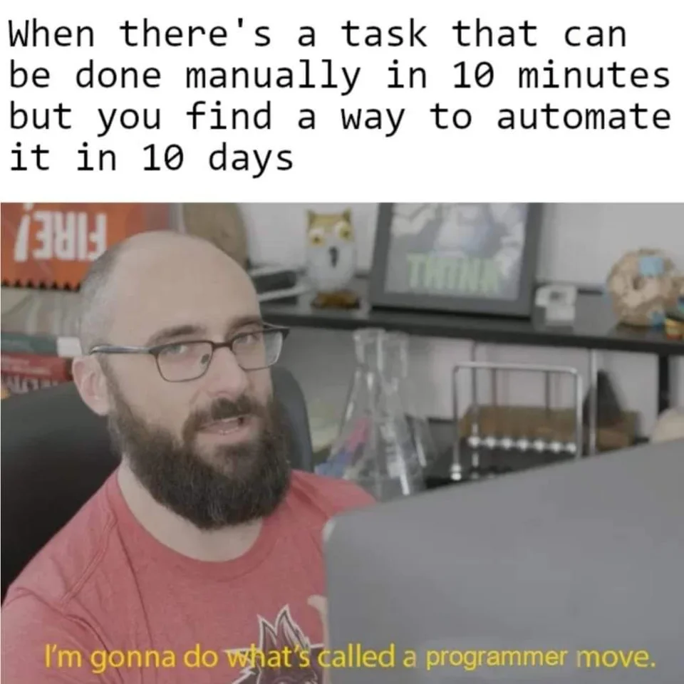

<!-- _backgroundColor: #f7eda8 -->

Shell Scripting

(entfällt krankheitsbedingt)

---

## Woche 6


<!-- _backgroundColor: #f7eda8 -->

Agile Entwicklung

---

### Lerntagebuch: Missverständnisse (Woche 4)

<!-- _backgroundColor: #c2f5a6 -->

1. > `git diff`: Änderungen zwischen Repository und Working Tree

---

### dem Wasserfall entkommen


<!-- _footer: '[Quelle](https://commons.wikimedia.org/wiki/File:Waterfall_model-de.svg)' -->

---

#### mögliche Probleme im Wasserfall

- Kommunikation: kaum, nur in Silos
- Plan: zu detailliert, nicht realistisch, unflexibel
- Fristen: zu starr, nicht einhaltbar, strategisch/politisch festgesetzt
- Software: erst nach langer Zeit einsatzbereit

---


## <!-- _footer: '[Source](https://comic.browserling.com/extra/35)' -->

---

### Agile Werte

Agilität ist eine Reihe von Werten und Prinzipien, die als [Agile Manifesto](https://agilemanifesto.org) und [12 Principles](https://agilemanifesto.org/principles.html) zusammengefasst sind.

Laut der Verfasser verbessern diese Werte den Softwareentwicklungsprozess und die Kundenzufriedenheit.

---

### Was Agilität nicht ist

- eine spezifische Methodologie
- ein Rahmenwerk
- ein Prozess

---

### Agile Manifesto (2001)

| mehr Wert beimessen              | weniger Wert beimessen      |
| -------------------------------- | --------------------------- |
| **individuals and interactions** | processes and tools         |
| **working software**             | comprehensive documentation |
| **customer collaboration**       | contract negotiation        |
| **responding to change**         | following a plan            |

Das [Agile Manifesto](https://agilemanifesto.org) zielt nicht darauf ab, die Elemente der rechten Spalte abzuschaffen. In Entscheidungsprozessen sollen aber die Elemente der linken Spalte vorrangig einbezogen werden.

---

#### Individuals and interactions (DOs)


- Prozesse/Tools nach dem Team ausrichten
- auch mal unkonventionelle Dinge ausprobieren
- Fehlerkultur entwickeln
- Autonomität und Eigenverantwortung ermöglichen

---

#### ... over processes and tools (DON'Ts)


- Prozessgläubigkeit und Beharren auf bestimmte Vorgehensweise
  - bei jedem PR müssen alle eine E-Mail bekommen
  - "Schick mir das als Excel-Formular"
  - Meeting planen, wenn man auch schnell aushelfen kann
  - alle müssen zwischen 9 und 16 Uhr im Büro sein
  - [Passierschein A38](https://www.youtube.com/watch?v=NQV6PA6BOVE)
- Beharren auf Hierarchien
- ungeeignete Metriken für Beurteilung des Outputs

---

#### Working software (DOs)


- jedes Inkrement (besser: jeder Commit) produziert funktionierende Software
- Qualität über Quantität
- gerade so viel dokumentieren, dass alle wissen, was zu tun ist

Vorteile:

- Kundenfeedback jederzeit möglich
- fehlerhafte Änderungen können sofort erkannt werden

---

#### ... over comprehensive documentation (DON'Ts)


- temporäre Dinge ausführlich dokumentieren
- alles im Vorfeld ins kleinste Detail ausplanen

---

### Projekt: User Stories als Anforderungs-Doku

<!-- _backgroundColor: #c2f5a6 -->

As a _..._ I want _..._ so that _..._ (was soll erreicht werden?)


([nicht ernst gemeinte User Story](https://twitter.com/shituserstory))

---

#### Customer collaboration (DOs)


- gegenseitiges Vertrauen schaffen
- direkte und regelmäßige Kommunikation
- Erfahrung, Wissen und Feedback des Kunden nutzen, um:
  - Aufgaben zu priorisieren
  - neue Aufgaben zu erstellen
  - Aufgaben zu verwerfen

---

#### ... over contract negotiation (DON'Ts)


- alle Anforderungen im Voraus genau festlegen
  - Aufwandsschätzungen auf falschen Annahmen
- auf langfristig geplanten Aufgaben beharren
- Kommunikation mit Kunden nur
  - über Projektmanager\*innen
  - alle paar Wochen in mehrstündigen Meetings

---

<!-- _backgroundColor: #c2f5a6 -->

### Projekt: Feedback einholen (Product Owner)

Auch ohne "Kunden" könnt ihr Feedback zu Eurem Programm einholen, z.B. indem Ihr es unbeteiligte Personen testen lasst:

- versteht der User Zweck und Bedienung des Programms
- treten unbedachte Grenzfälle/Fehler auf
- hat der User Verbesserungsvorschläge / Wünsche
- User "laut denken" lassen für sonstige Anmerkungen

---

#### Responding to change (DOs)


- Mindset:
  - die Zukunft ist nicht vorhersehbar
  - Veränderungen verbessern das Projekt
- Priorisierung regelmäßig auf den Prüfstand stellen
- Nutzen der zu entwickelnden Software regelmäßig validieren
- komplexe Aufgaben in kleinere Pakete herunterbrechen, um flexibel zu bleiben

---

#### ... over following a plan (DON'Ts)


- annehmen, dass die Anforderungen zu Beginn vollständig sind
- annehmen, dass sich die Anforderungen nachträglich nicht ändern
- sich nur nach dem Plan richten:

> The project manager’s thinking, as represented by the project plan, **constrains the creativity and intelligence** of everyone else on the project to that of the plan, rather than engaging everyone’s intelligence to best solve the problems.

[Ken Schwaber](https://kenschwaber.wordpress.com/2011/04/24/agility-and-pmi/) (2011)

---

<!-- _backgroundColor: #c2f5a6 -->

### Projekt: planlos?

- **grobe** Planung für gesamten Projektzeitraum
- **detaillierte** Planung nur für nahe Zukunft (2 Wochen)
- simpel & funktionierend **>** ausgefeilt & halbfertig
- regelmäßiger Austausch

---

### Agil oder nicht agil?

> When "Agile" ideas are applied poorly, they often lead to more interference with developers, less time to do the work, higher pressure, and demands to "go faster".

[Ron Jeffries](https://ronjeffries.com/articles/018-01ff/abandon-1/) (2018)

> However, the values and principles of the Manifesto for Agile Software Development still offer the best way I know to build software.

[Ron Jeffries](https://ronjeffries.com/articles/018-01ff/abandon-1/) (2018)

---

### Agilität: sonstige Ressourcen

<!-- _backgroundColor: lightblue -->

<http://www.extremeprogramming.org/>

---

## Woche 7

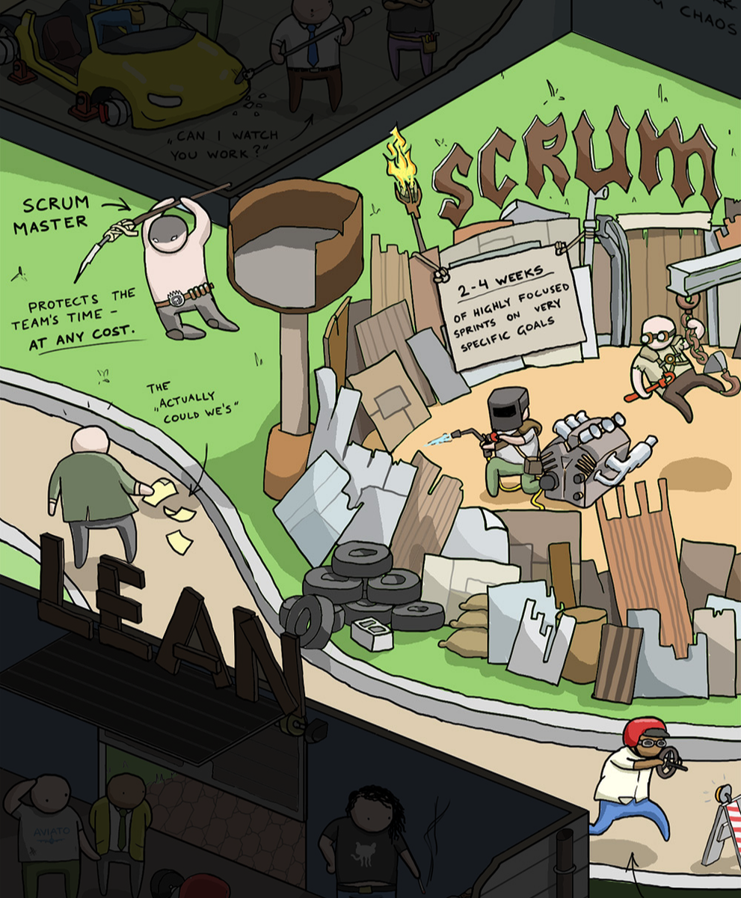

<!-- _footer: '[Source](https://toggl.com/track/developer-methods-infographic/)' -->
<!-- _backgroundColor: #f7eda8 -->

Scrum

---

### Lerntagebücher: Diskussion (Woche 6)

<!-- _backgroundColor: #c2f5a6 -->

1. > User Story: (…) eine art "Geschichte des Benutzers" wobei der Benutzer verschiedene Rollen einnehmen kann (der Benutzer kan auch der Product Owner(Scrum) sein.)

---

## Scrum

eine (mögliche) praktische Ausprägung von Agilität

**Ziel**: komplexe Aufgaben in einer sich verändernden Umgebung lösen

**Methode**: einfach und offen gehaltene Rahmenbedingungen einer iterativen Arbeitsweise mit inkrementellen Ergebnissen

---

### Scrum als Kompromiss?

> Scrum was invented to function in hostile environments, it's a really interesting contract between hard-pushing execs and devs needing time to think.
> [Alistair Cockburn](https://twitter.com/TotherAlistair/status/1405260113431171076?s=20) (2021)

| Management                                                          | Entwickelnde                                                       |
| ------------------------------------------------------------------- | ------------------------------------------------------------------ |
| möchte Richtung vorgeben, langfristig planen und fordert Ergebnisse | benötigen Freiheit und Zeit zum Denken, Untersuchen, Erforschen... |

---


---

### Scrum Team

<!-- _backgroundColor: #fec7e2  -->

1. Product Owner
2. Scrum Master
3. Developer

- überschaubar (<= 10 Personen) und interdisziplinär
- selbstorganisiert ohne Hierarchien
- respektiert und unterstützt sich
- offen und anpassungsfähig
- kommunikativ

---

#### Scrum Team: Product Owner

- brennt für das Produkt (will das Beste rausholen)
- macht verständlich, was das Produkt leisten soll (_Product Goal_)
- pflegt und priorisiert den langfristigen Plan (_Product Backlog_)
- urteilt, ob ein Arbeitsergebnis abgeschlossen ist

---

#### Scrum Team: Scrum Master

- verantwortlich für die Einführung von Scrum
- vermittelt die Scrum-Werte und macht sie verständlich
- unterstützt bei der Umsetzung der Scrum-Events
- löst Blockaden und beseitigt Hindernisse des Teams
- darf coachen, aber keine Anweisungen erteilen

---

#### Scrum Team: Developer(s)

- erstellen einen kurzfristigen Plan (Sprint Backlog)
- legen fest, was "fertig" bedeutet (Definition of Done)
- ziehen sich gegenseitig zur Verantwortung
- arbeiten i.d.R. nicht an mehreren Dingen gleichzeitig

---

### Scrum Events

<!-- _backgroundColor: #fec7e2  -->

1. Sprint
2. Sprint Planning
3. Daily Scrum
4. Sprint Review
5. Sprint Retrospective

- sorgen für regelmäßige Transparenz
- minimieren Notwendigkeit für sonstige Meetings

---

#### Scrum Artefakt: Product Backlog

- enthält
  - das Produkt-Ziel (zukünftiger Zustand des Produkts)
  - beschreibende Einträge, wie das Produkt-Ziel erreicht wird
- Einträge sind danach geordnet, was das Produkt am meisten verbessert
- durch "Backlog Refinements" werden einzelne Einträge kontinuierlich präzisiert, angepasst, zerlegt und besser verstanden

---

<!-- _backgroundColor: #c2f5a6 -->

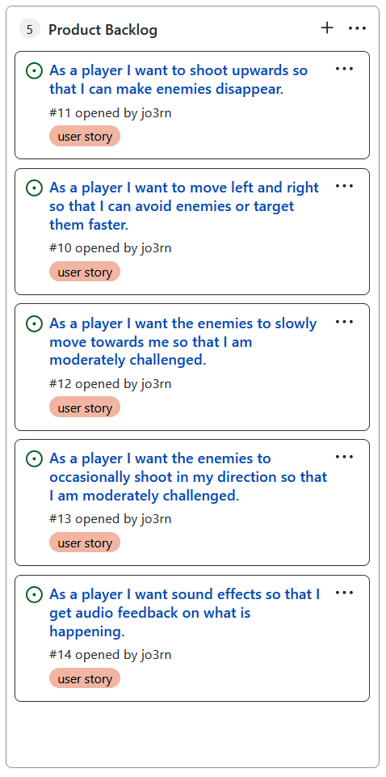

##### Projekt: Product Backlog

- Verantwortung: Product Owner
- Spalte im [GitHub Project Board](https://docs.github.com/en/issues/organizing-your-work-with-project-boards)
- User Stories beschreiben den gewünschten Zustand der Software
- zur Präsentation sollten noch User Stories offen sein (= mehr planen als implementiert werden kann)
- PO & Devs leiten anhand der User Stories konkrete Aufgaben ab (dokumentiert z.B. als Issues)

<!-- _footer: '(unvollständiges) Product Backlog für das Spiel Space Invaders' -->

---

#### Scrum Event: Sprint

- ein Zeitraum mit fester Länge (i.d.R. 2-4 Wochen), in dem die anderen Scrum Events stattfinden
- Team verpflichtet sich auf ein konkretes Ziel
- am Ende entsteht mind. eine Produktverbesserung ("Increment")

---

##### Scrum Artefakt: Increment

- konkreter Schritt in Richtung Produkt-Ziel
- fertig, nutzbar und wertvoll
- befolgt die "Definition of Done"
  - formale Beschreibung aller erforderlichen Qualitätsmerkmale, z.B. Styleguide eingehalten, alle Tests bestanden, Dokumentation vorhanden, von Fachleuten begutachtet
  - DoD wird vom Scrum Team oder der Organisation festgelegt

---

#### Scrum Event: Sprint Planning

Timebox: max. 8h (4-Wochen-Sprint)
Teilnehmende: Scrum Team + wer sonst Input liefern kann

1. das Sprint-Ziel gemeinsam erarbeiten

   - **Wofür** machen wir den Sprint?

2. Einträge aus dem Product Backlog auswählen und verfeinern

   - **Was** erreichen wir in diesem Sprint?

3. die Entwickler\*innen zerlegen die Einträge in kleine Aufgaben
   - **Wie** erledigen wir die Arbeit in diesem Sprint?

---

##### Scrum Artefakt: Sprint Backlog

- enthält
  - das Sprint-Ziel
  - die ausgewählten Einträge des Product Backlogs
  - weitere abgeleitete Aufgaben
- sollte während des Sprints nur im Ausnahmefall verändert werden
- wird nach jedem Sprint gelöscht/zurückgesetzt

---

<!-- _backgroundColor: #c2f5a6 -->

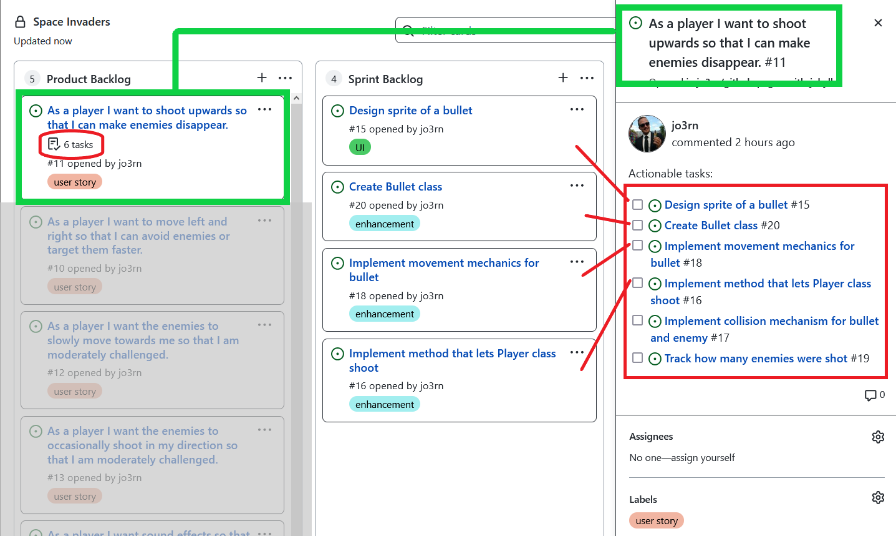

##### Projekt: Sprint Backlog (Developer)

<!-- _footer: '(unvollständiges) Sprint Backlog für das Spiel Space Invaders' -->

---

#### Scrum Event: Daily Scrum

Timebox: max. 15min
Teilnehmende: alle, die an etwas im Sprint Backlog arbeiten

- findet wenn möglich täglich zur selben Zeit am selben Ort statt
- den Fortschritt hin zum Sprint-Ziel eruieren
  - Gibt es Hindernisse oder offene Entscheidungen?
- einen umsetzbaren Plan für den kommenden Arbeitstag erstellen
  - ggf. das Sprint Backlog anpassen

---

#### Scrum Event: Sprint Review

Timebox: max. 4h (4-Wochen-Sprint)
Teilnehmende: Scrum Team + wichtige Stakeholder

- das Ergebnis des Sprints vorstellen
- Fortschritt in Richtung Produkt-Ziel evaluieren
- Entscheidungen für das weitere Vorgehen treffen
  - Haben sich äußere Umstände geändert?
  - Sind Anpassungen nötig?
  - Was ist als Nächstes zu tun?
  - Wie sollte das Product Backlog angepasst werden?

---

#### Scrum Event: Sprint Retrospective

Timebox: max. 3h (4-Wochen-Sprint)
Teilnehmende: Scrum Team

- Wie kann die Qualität und Effektivität des Teams in Bezug auf Individuen, Interaktionen, Prozesse und Werkzeuge verbessert werden?
- Was lief im letzten Sprint gut?
- Gab es Probleme und wie könnte man sie lösen / wurden sie gelöst?
- umsetzbare Erkenntnisse können ins Sprint Backlog des nächsten Sprints übernommen werden

---

<!-- _backgroundColor: #c2f5a6 -->

##### Projekt: 2 Retrospektiven durchführen

- Organisation & Durchführung durch Scrum Master
- [ein Beispiel wie eine Retro ablaufen kann](https://www.atlassian.com/team-playbook/plays/retrospective)
- jede Retro durch mind. eine kurze Übung oder ein Spiel anreichern (Anregungen online, z.B. [hier](https://www.komplexitaeter.de/inspiration/online-retro-scrum-teams/) und [hier](https://geekbot.com/blog/10-retrospective-games-ideas-to-keep-your-retros-fun-engaging-and-productive/))
- kurzes Protokoll umfasst:
  - angesprochene Probleme / Erfolge
  - durchgeführte Übung(en) (Ablauf & Ergebnis)
  - abgeleitete Änderungen / Aufgaben

---

### Iterativer Prozess

Das sich wiederholende Schema des Sprints ist darauf ausgerichtet Veränderungen zu bewirken.

**Transparenz** ermöglicht **Überprüfung** ermöglicht **Anpassung**.

---

### Scrum: sonstige Ressourcen

<!-- _backgroundColor: lightblue -->

<https://scrumguides.org/index.html>
Scrum Guide online lesen oder herunterladen

<https://www.scrum.org/open-assessments>
kurze Tests zum Scrum-Verständnis

---

## Woche 8


<!-- _backgroundColor: #f7eda8 -->

<!-- _footer: '[Source](http://gunshowcomic.com/648)' -->

DevOps

---

<!-- _backgroundColor: #c2f5a6 -->

### Projekt: Was macht der PO?

- formuliert und verfeinert User Stories, Aufgaben & Vision
- gibt Akzeptanzkritieren vor und überprüft deren Einhaltung
- entwickelt eine passende Methode der Priorisierung
- analysiert Markt und Stand der Technik
- prüft das Produkt selbst
- holt Feedback ein (z.B. User Tests)
- Kommunikationskanal zu Stakeholdern (z.B. Auerbach)
- bereitet Product Pitch vor und kann ihn jederzeit abfeuern

---

### Lerntagebücher: Diskussion (Woche 7)

<!-- _backgroundColor: #c2f5a6 -->

1. > [Im] Product Backlog (...) definiert der Product Owner seine Ziele und Wünsche für das Projekt (...). Diese werden dann von dem Scrum Master (...) in das Sprint Backlog (...) übertragen.
2. > Der Developer erstellt einen Plan für das Projekt und entscheidet auch mit wann ein Meilenstein als erledigt gilt.
3. > Am Ende eines Projekts ist es hilfreich nocheinmal über das Product Backlog drüber zu gehen, um nachzuschauen ob alles umgesetzt wurde, was gewünscht war.

---


<!-- _footer: '[Source](https://commons.wikimedia.org/wiki/File:Devops-toolchain.svg)' -->

---

[10+ Deploys Per Day: Dev and Ops Cooperation at Flickr](https://www.youtube.com/watch?v=LdOe18KhtT4)
(Erste Erwähnung von "Dev Ops")

Gute Zusammenarbeit zwischen **Development** und **Operations** durch

- automatisierte Infrastruktur (möglichst wenig manuelle Prozesse)
- gemeinsame Versionskontrolle
- Build in einem Schritt
- Deploy/Release in einem Schritt
- Feature Flags

---

### Kultur der Kollaboration

- Vertrauen zwischen Development und Operations
- keine Stereotypen unterstellen
- keine Angst vor Veränderungen
- Expertise öffentlich machen
- Probleme und Fehler ohne Schuldzuweisung gemeinsam angehen
- gemeinsame, sichtbare Metriken
- Messaging Tools (Slack, MS Teams,...)

---

### Continuous Integration

Zeitpunkt: z.B. bei Merge auf Haupt-Branch

- den **Build-Prozess** soweit wie möglich automatisieren
  - statische Code-Analyse
  - Kompilieren
  - deploybare Artefakte erzeugen
- den Build soweit wie möglich automatisch testen lassen
  - Tests müssen geschrieben werden
  - Tests müssen auf einem CI-Server ausgeführt werden

---

#### CI-Ergebnis sichtbar machen

= Verfall schnell bemerken und früh stoppen

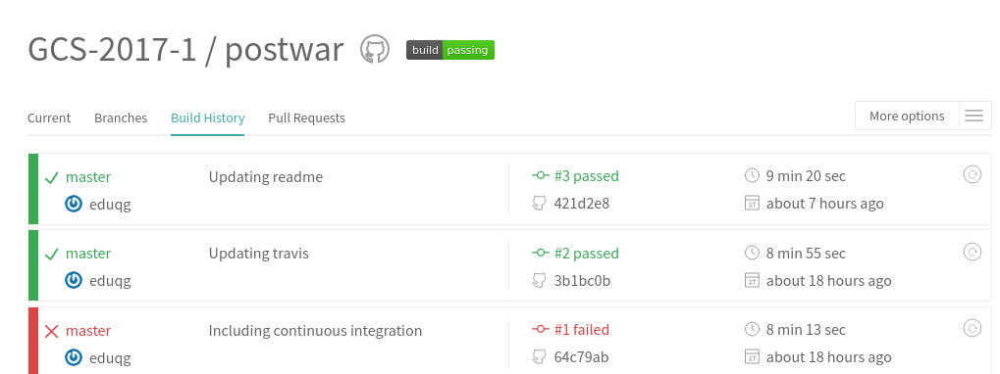


<!-- _footer: '[Source](https://commons.wikimedia.org/wiki/File:ContinuousIntegration.png)' -->

---

#### CI und Scrum

- Wiederholung:
  **Transparenz** ermöglicht **Überprüfung** ermöglicht **Anpassung**.
  Transparenz erfordert **Mut** und **Offenheit**.
- "grüner Build"
  - als Teil der Definition of Done
  - signalisiert "brauchbaren" Stand für das Sprint Review
- CI-Ergebnisse als Input für Daily und Retrospektive:
  Gibt es Prozessprobleme oder Blockaden?

---

#### Wenn CI fehlt


> Airbus engineers in Germany (...) were using (...) computer-aided design software-version 4. Engineers in Toulouse (...) were using a newer version of the software (...) Those errors are going to cost Airbus **billions**.

<!-- _footer: '[Source 1](https://www.baselinemag.com/c/a/Projects-Processes/PLM-Boeings-Dream-Airbus-Nightmare/1) [Source 2](https://commons.wikimedia.org/wiki/File:Parts_and_systems_of_Airbus_A380_on_MAKS_2011_(02).jpg)' -->

---

#### Continuous Integration: Vorteile

- ersichtlich, ob sich Änderungen nahtlos in Bestehendes integrieren
  - Releases erfordern keinen großen Aufwand
- sofortige Warnung wenn der Build fehlschlägt
  - Signal an alle, dass sie dem Build nicht vertrauen können
  - Entwickler\*innen können sich drum kümmern, wenn das Wissen um die Änderung noch "frisch" ist
  - weniger Bugs in der Produktiv-Version
- QA-Team wird weniger mit "kleinen" Fehlern aufgehalten

---

### Continuous Delivery


den **Auslieferungs-Prozess** soweit wie möglich automatisieren
("mit Klick auf einen Button"):

  - Weiterentwicklungen in eine Testumgebung bringen
  - Releases in eine Produktivumgebung bringen
  - User sieht nur fertig entwickelte Features


<!-- _footer: '[Source](https://commons.wikimedia.org/wiki/File:Noun_48949_-_Delivery.svg)' -->

---

#### Continuous Delivery: Vorteile

- häufigere Auslieferung
  - höhere Kundenzufriedenheit
  - schnelleres Feedback
- kleinere Releasepakete
  - bessere Fehlereingrenzung
  - geringere Komplexität
- alle Beteiligten können (theoretisch) die Software selbst zum Laufen bringen

---

### Continuous Deployment

...passiert wenn Continuous Delivery ohne manuelles Zutun abläuft.

Unveröffentlichte Features sind im Release...

- bereits (teil-)integriert (siehe z.B. [PokeMiners](https://twitter.com/poke_miners))
- "aus der Ferne" an-/ausschaltbar, z.B. via [Feature Flags](https://docs.gitlab.com/ee/operations/feature_flags.html)

---

### Statische Analyse von Code

- vom Team festgelegte & automatisiert überprüfbare Regeln
- bei Regelverstoß: Hinweis oder automatische Korrektur
- in IDEs integriert oder als CI-Schritt ausgeführt


---

#### Statische Analyse: Code Smells

qualitative Schwachstellen, Bugs, unnötig komplizierte Konstrukte,...

Beispiele:

- ungenutzte Variablen
- nicht erreichbarer Code
- Duplikate
- Schleifen mit nur einer Iteration
- [`scanf()` ohne Feldbreite](https://rules.sonarsource.com/c/RSPEC-1079)
- [Go To Statement Considered Harmful](https://www.cs.utexas.edu/~EWD/transcriptions/EWD02xx/EWD215.html)

---

#### Statische Analyse: Code Style

Vorgaben an die Syntax von Code

Beispiele:

- einheitliche Einrückung
- Namenskonventionen
- Reihenfolge von Importen, Schlüsselwörtern
- Zeilenlänge
- Klammerung von Blöcken
- dokumentiert, z.B. via [Javadoc](https://www.oracle.com/java/technologies/javase/javadoc-tool.html) oder [Doxygen](https://www.doxygen.nl/)

---

##### Code Style: Linter

1. Zu überprüfenden Regeln werden in einer Konfigurationsdatei (z.B. `.xml` oder `.json`) festgelegt.
2. Ein Programm (_Linter_) sucht die Dateien nach Regelbrüchen ab.

Warum Code Style Check automatisieren:

|                                  | Computer | Mensch |
| -------------------------------- | -------- | ------ |
| Fehler schnell erkennen          | x        |        |
| verlässlich alle Fehler erkennen | x        |        |
| hat eine Meinung                 |          | x      |

---

### GitHub Actions

Idee: Ein [Event auf GitHub](https://docs.github.com/en/actions/learn-github-actions/events-that-trigger-workflows) löst eine automatisierte Aktion aus, z.B.:

- Push/Merge auf `main` Branch -> neue Release-Version erstellen
- ein Issue wird erstellt -> formale Kriterien überprüfen
- ein Pull Request wird eröffnet -> Code kompilieren und testen

Was wann passieren soll wird in einer [YAML-Datei](https://docs.github.com/en/actions/learn-github-actions/workflow-syntax-for-github-actions) formuliert, welche im Repo im Verzeichnis `.github/workflows` liegt.

---

### Projekt: Linting mit GitHub Action

<!-- _backgroundColor: #c2f5a6 -->

- Verantwortung: Developer
- [GitHub Super-Linter](https://github.com/github/super-linter) einrichten
  - [clang-format](https://clang.llvm.org/docs/ClangFormatStyleOptions.html) für C ([Beispiel-Regeln](https://gist.github.com/jo3rn/946f3170d06b334b714e6ca937d2990f))
  - [checkstyle](https://checkstyle.org/) für Java ([Beispiel-Regeln](https://gist.github.com/jo3rn/3c9815d464a26dc0c0c55964cb89b2cf))
- Regeln dürfen angepasst, aber nicht komplett deaktiviert werden
- Linter soll mind. vor Merge auf Haupt-Branch laufen
  besser noch: bei jedem Commit

Videos zur Einrichtung aus letztem Jahr: [1](https://www.youtube.com/watch?v=NgLL0B9rZLk) & [2](https://www.youtube.com/watch?v=w3gDzgTuVcs) (nicht ganz up to date)

---

### DevOps: sonstige Ressourcen

<!-- _backgroundColor: lightblue -->

<https://www.oreilly.com/library/view/the-phoenix-project/9781457191350/>
Buch: The Phoenix Project (Gene Kim, Kevin Behr, George Spafford)

<https://www.atlassian.com/devops>
DevOps Übersicht (Firma Atlassian bietet DevOps-Tools an)

<https://docs.github.com/en/actions>
GitHub Actions Dokumentation

---

## Woche 9

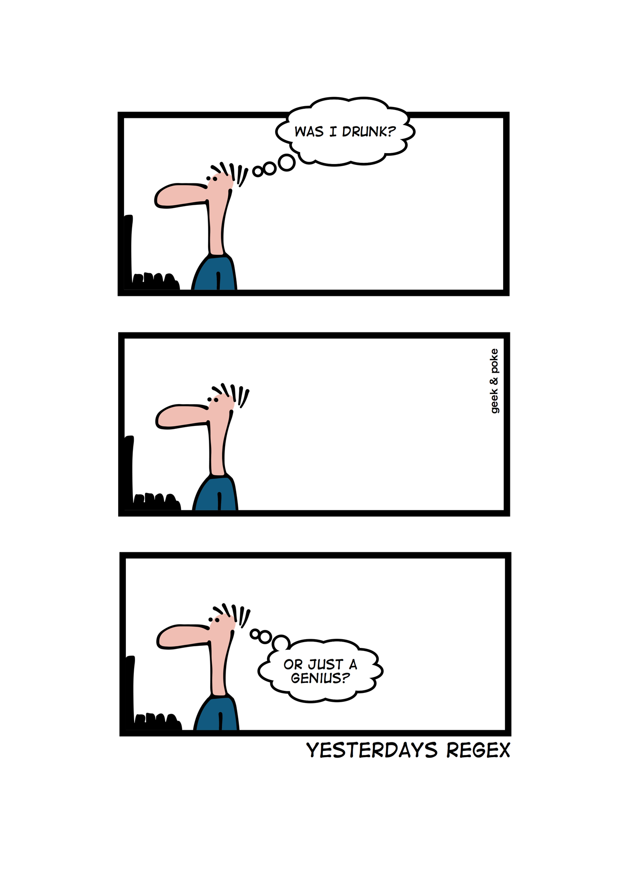

<!-- _backgroundColor: #f7eda8 -->

<!-- _footer: '[Source](https://geek-and-poke.com/geekandpoke/2013/12/3/yesterdays-regex)' -->

Reguläre Ausdrücke

---

### Wiederholung: Pattern Matching mit Git

Konsole:
`git add *.txt`

.gitignore:

```text
*.class
[abc].txt
/root/**/leaf/
```

---

### Definition: Regulärer Ausdruck

> An expression that describes a set of strings
> [Oxford Handbook of Computational Linguistic](https://books.google.de/books?id=yl6AnaKtVAkC&pg=PA754&redir_esc=y#v=onepage&q&f=false)

> patterns used to match character combinations in strings
> [MDN Web Docs](https://developer.mozilla.org/en-US/docs/Web/JavaScript/Guide/Regular_Expressions)

Eine formalere Definition findet sich in:
["Representation of events in nerve nets and finite automata" (S.C. Kleene)](https://www.rand.org/content/dam/rand/pubs/research_memoranda/2008/RM704.pdf) und dessen Nachfolgern

---

### Suche nach Mustern in Texten

Beispiel-Muster: eine `1` gefolgt von einer weiteren Zahl

| Regex    | Treffer                                  | kein Treffer |
| -------- | ---------------------------------------- | ------------ |
| `1[0-9]` | <span class="highlight">12</span>3456789 | 987654321    |

---

### [grep](https://www.gnu.org/software/grep/manual/grep.html) (global regular expression print)

> `grep` prints lines that contain a match for one or more patterns.

Beispiele:

- `grep Jörn names.txt` sucht nach Jörn in `names.txt`
- `grep 1[0-9] nums.txt` sucht nach `10`, `11`, ..., `19` in `nums.txt`
- `echo 123456 | grep '1\|2'` sucht nach `1` oder `2` in `123456`

---

#### grep unterstützt [verschiedene RegEx Syntaxen](https://www.gnu.org/software/grep/manual/grep.html#grep-Programs)

`-G`: default - "basic regular expression" (BRE)
`-E`: "extended regular expression" (ERE)
`-P`: "Perl-compatible regular expression" (PCRE)

Übersicht der Unterschiede zwischen diesen (und weiteren): [https://www.regular-expressions.info/refflavors.html](https://www.regular-expressions.info/refflavors.html)

---

### RegEx-Notation: einfache Zeichen (1/2)

- ein `a`
- die Buchstabenreihenfolge `ber`

| Regex | Treffer                                                                                                                                                                     | kein Treffer |
| ----- | --------------------------------------------------------------------------------------------------------------------------------------------------------------------------- | ------------ |
| `a`   | Rh<span class="highlight">a</span>b<span class="highlight">a</span>rberb<span class="highlight">a</span>rb<span class="highlight">a</span>r<span class="highlight">a</span> | Erdbeeremil  |
| `ber` | Rhabar<span class="highlight">ber</span>barbara                                                                                                                             | Erdbeeremil  |

---

### RegEx-Notation: einfache Zeichen (2/2)

Diese **Sonderzeichen** können eine besondere Bedeutung in einer RegEx-Syntax haben. Sie müssen ggf. escaped werden (z.B. mit `\`):

```text
\   Backslash           *   Stern
^   Dach                +   Plus
$   Dollar              ()  runde Klammern
.   Punkt               []  eckige Klammern
|   Pipe                {}  geschweifte Klammern
```

---

### RegEx-Notation: "Spaß" mit Sonderzeichen

| grep Befehl        | Treffer                                                                      | kein Treffer  |
| ------------------ | ---------------------------------------------------------------------------- | ------------- |
| `grep '1$'`        |                                                                              | 1$ + 1$ = 2$  |
| `grep '1$ +'`      | <span class="highlight">1\$ +</span> 1$ = 2$                                 |               |
| `grep -E '1$ +'`   |                                                                              | 1$ + 1$ = 2$  |
| `grep -E '1\$ +'`  | <span class="highlight">1\$</span> + 1$                                      | 1\$+1\$=2$    |
| `grep -E '1\$ \+'` | <span class="highlight">1\$ +</span> 1$ = 2$                                 |               |
| `grep '1\$'`       | <span class="highlight">1\$</span> + <span class="highlight">1\$</span> = 2$ |               |
| `grep '2$$'`       | 1$ + 1$ = <span class="highlight">2$</span>                                  | 1$ + 1$ = 2$$ |

<!-- _footer: 'siehe auch [BRE vs. ERE](https://www.gnu.org/software/sed/manual/html_node/BRE-vs-ERE.html)' -->

---

### RegEx-Notation: [Character Class]

- ein `a` oder ein `R`
- Großbuchstaben zwischen `I` und `Z`
- **kein** (`^`) Kleinbuchstabe zwischen `a` und `g` oder `i` und `z`
  sowie **kein** Großbuchstabe zwischen `A` und `Z`

| Regex          | Treffer                                                                                                                                                                                                    | kein Treffer |
| -------------- | ---------------------------------------------------------------------------------------------------------------------------------------------------------------------------------------------------------- | ------------ |
| `[aR]`         | <span class="highlight">R</span>h<span class="highlight">a</span>b<span class="highlight">a</span>rberb<span class="highlight">a</span>rb<span class="highlight">a</span>r<span class="highlight">a</span> | Erdbeeremil  |
| `[I-Z]`        | <span class="highlight">R</span>habarberbarbara                                                                                                                                                            | Erdbeeremil  |
| `[^a-gi-zA-Z]` | R<span class="highlight">h</span>abarberbarbara                                                                                                                                                            | Erdbeeremil  |

---

### RegEx-Notation: [Character Class] Abkürzungen

- `\d` Ziffer
- `\w` Buchstabe oder Underscore
- `\s` Whitespace Zeichen
- `.` egal was

| Regex | Treffer                                                                                                                                      | kein Treffer   |
| ----- | -------------------------------------------------------------------------------------------------------------------------------------------- | -------------- |
| `\d`  | Rha<span class="highlight">6</span>ar<span class="highlight">6</span>er<span class="highlight">6</span>ar<span class="highlight">6</span>ara | Erdbeeremil    |
| `\s`  | Rhabarberbarbaras Bar                                                                                                                        | Erdbeeremileck |
| `.`   | Erdbeeremil                                                                                                                                  |

---

### RegEx-Notation: Wiederholungen

```text
?     0 oder 1 Mal                  +     ein oder mehrmals
*     0 der mehrmals               {n}    n-mal
```

| Regex      | Treffer                                                                                                       | kein Treffer |
| ---------- | ------------------------------------------------------------------------------------------------------------- | ------------ |
| `arb?`     | Rhab<span class="highlight">arb</span>erb<span class="highlight">arbar</span>a                                | Erdbeeremil  |
| `rbe*`     | Rhaba<span class="highlight">rberb</span>a<span class="highlight">rb</span>ara                                | Erdbeeremil  |
| `ba+`      | Rha<span class="highlight">ba</span>rber<span class="highlight">ba</span>r<span class="highlight">ba</span>ra | Erdbeeremil  |
| `(bar){2}` | Rhabarber<span class="highlight">barbar</span>a                                                               | Erdbeeremil  |

---

### RegEx-Notation: Alternierung

- `|` logisches Oder

| Regex                    | Treffer                                                                                                                                      | kein Treffer |
| ------------------------ | -------------------------------------------------------------------------------------------------------------------------------------------- | ------------ |
| <code>ba&#124;ber</code> | Rha<span class="highlight">ba</span>r<span class="highlight">ber</span><span class="highlight">ba</span>r<span class="highlight">ba</span>ra | Erdbeeremil  |
| <code>r(a&#124;b)</code> | Rhaba<span class="highlight">rb</span>e<span class="highlight">rb</span>a<span class="highlight">rb</span>a<span class="highlight">ra</span> | Erdbeeremil  |

---

### RegEx-Notation: Position (Anker)

- `^` Beginn der Zeichenkette
- `$` Ende der Zeichenkette
- `\b` nach einem Wort (zwischen `\w` und nicht-`\w`)

| Regex | Treffer                                                                              | kein Treffer |
| ----- | ------------------------------------------------------------------------------------ | ------------ |
| `^r`  | <span class="highlight">r</span>habarberbarbara                                      | erdbeeremil  |
| `a$`  | Rhabarberbarbar<span class="highlight">a</span>                                      | Erdbeeremil  |
| `s\b` | Rhabarberbarbara<span class="highlight">s</span> Bar<span class="highlight">s</span> | Erdbeeremil  |

---

### Kleine Übungspause

<!-- _backgroundColor: #fec7e2  -->

1. `bb|[^b]{2}` bzw. `grep 'bb\|[^b]\{2\}'`
   Welches Zitat versteckt sich hinter diesem regulären Ausdruck?
   Tipp: Es hat etwas mit Shakespeare zu tun.

2. Sucht auf [angio.net/pi](https://www.angio.net/pi/) nach eurem Geburtsdatum in $\pi$ (Pi)
   - dort könnt ihr auch [verschiedene Dateien mit x Stellen von $\pi$](https://www.angio.net/pi/digits.html) herunterladen und auf der Konsole mit `grep` testen

---

### [Suchen mit vim](https://vim.fandom.com/wiki/Searching)

- `/pattern`: nach _`pattern`_ suchen (vorwärts)
- `?pattern`: nach _`pattern`_ suchen (rückwärts)
- `n`: zum nächsten Ergebnis springen
- `N`: zum nächsten Ergebnis in umgekehrter Richtung springen
- `:%s/old/new/g`: alles, auf das _`old`_ zutrifft mit _`new`_ ersetzen
- `:%s/old/new/gc`: wie oben, aber Ersetzen muss bestätigt werden
  (`c`onfirm)

---

### [Suchen mit Git](https://git-scm.com/book/en/v2/Git-Tools-Searching)

- `git grep`_`pattern`_ sucht in den Dateien im Arbeitsverzeichnis nach _`pattern`_.
  - ähnlich wie `grep -r --color=always`_`pattern`_`.`
  - ignoriert das `.git`-Verzeichnis und hat [tlw. andere Optionen](https://git-scm.com/docs/git-grep#_options)
  - auch `git grep`_`pattern`_`HEAD~6` usw. möglich
- `git log -i --grep="add"` filtert das Commit-Log nach `add`
  (mit `-i` case-insensitive)
- `git log -G`_`pattern`_ listet die Commits, in denen sich die Vorkommen von _`pattern`_ geändert haben

---

### Kommandozeilen-Tools [sed](https://www.gnu.org/software/sed/manual/sed.html) & [awk](https://www.gnu.org/software/gawk/manual/gawk.html)

sed & awk sind Programme, die

1. Daten einlesen
2. Daten (zeilenweise) **filtern** und/oder manipulieren
3. Daten (ggf. neu formatiert) ausgeben

RegEx mit sed und awk: `/`_`pattern`_`/`

---

### Beispiele für sed & awk

`sed 's/0\+\([1-9]\)/\1/' nums.txt`

- entfernt alle Nullen am Anfang einer Zahlenfolge (`s`ubstitute)
- Klammern `(...)` bilden eine "capturing group", die mit `\1` wiederverwendbar ist

`awk '/[ab]/ {print $1}' names.txt`

- gibt das erste Wort aller Einträge aus, die ein `a` oder `b` enthalten

---

### hangman cheating (1/2)

Das FreeBSD Spiel [hangman](https://manpages.debian.org/bullseye/bsdgames/hangman.6.en.html) speist sich aus der Datei `/usr/share/dict/words`, welche sich natürlich auch filtern lässt, z.B.:

- Anzahl Buchstaben gesamt, z.B. 7:
  - `grep '^.\{7\}$'`_`file`_ oder `grep '^.......$'`_`file`_
  - `sed -n '/^.\{7\}$/p'`_`file`_
  - `awk 'length($0)==7'`_`file`_

---

### hangman cheating (2/2)

- Position erratener Buchstaben, z.B. `t` an dritter Stelle:
  - `grep`_`???`_
  - `sed`_`???`_
  - `awk`_`???`_
- nicht vorkommende Buchstaben, z.B. kein `b` und kein `m`:
  - `grep`_`???`_
  - `sed`_`???`_
  - `awk`_`???`_

---

### Projekt: Feature Request: Easter Egg einbauen

<!-- _backgroundColor: #c2f5a6 -->

Ein Easter Egg ist ein verstecktes Ereignis in Software, Film, Musik,...

Beispiele:

- `about:mozilla` in der Adressbar des Firefox Browsers
- Der Igel im Bild des [Eintrags zu Easter Eggs auf Wikipedia](https://de.wikipedia.org/wiki/Easter_Egg)
- Die Skala des IMDb Ratings von [_This is Spinal Tap_](https://www.imdb.com/title/tt0088258/)
- `:help 42` in vim
- "do a barrel roll" oder "askew" in der Google Suche

---

### RegEx: sonstige Ressourcen

<!-- _backgroundColor: lightblue -->

- <https://regexone.com/>
  interaktive Übungen zu Regulären Ausdrücken

- <https://regex101.com/>
  Test-Tool für verschiedene RegEx-Engines

---

## Woche 10

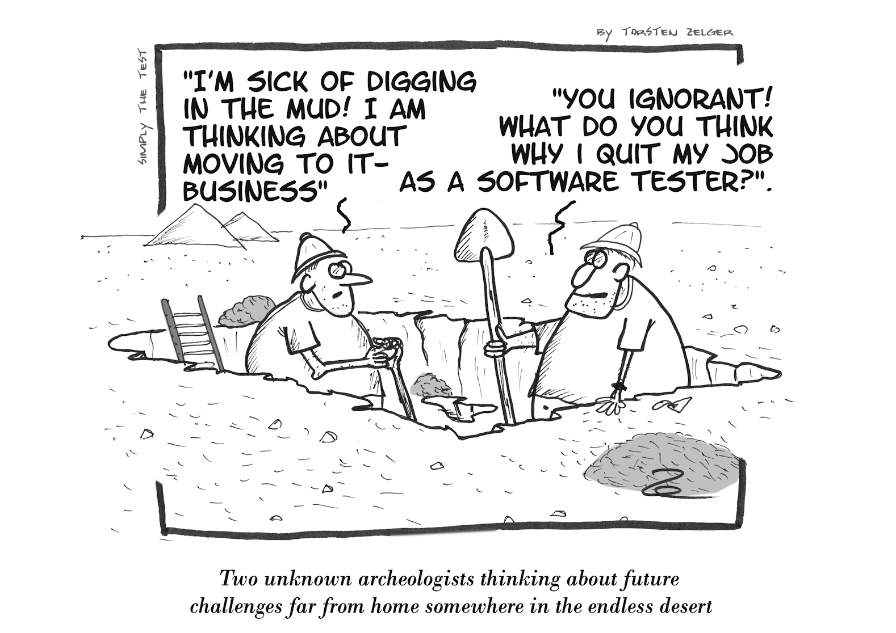

<!-- _backgroundColor: #f7eda8 -->

<!-- _footer: '[Source](https://simply-the-test.blogspot.com/2020/08/digging-in-mud.html)' -->

Testing & Debugging

---

### Testing

- deckt nicht erwünschtes Verhalten auf
- dokumentiert erwünschtes Verhalten (Spezifikation)
- schafft Vertrauen für Änderungen am Code
- beeinflusst Softwaredesign ("testability")

---

#### Unit Test

- Unit = kleine, für sich stehende Komponente im Code
  - Funktion(en), Method(en)
  - Klasse(n), Datei(en), Modul(e)
- Unit Tests sind schnell, häufig und automatisiert ausführbar

in Bezug auf Agile Development:

- Autor\*in des Codes und der zugehörigen Tests identisch
- Teil von Continuous Integration und Definition of Done

---

##### Unit Test: vereinfachtes Beispiel

zu testende Einheit (Unit):

```C
int add(int a, int b) {
  return a + b;
}
```

Tests:

```C
void main() {
  printf("%s\n", add(2, 3) == 5 ? "ok" : "Fehler!");
  printf("%s\n", add(-2, 3) == 1 ? "ok" : "Fehler!");
}
```

---

##### Unit Test: welche Testfälle?

- gültige und ungültige Eingaben von Äquivalenzklassen
  - z.B. Wertebereiche, leere Elemente, Datentypen, `null`
- Grenzfälle
  - größte/kleinste/längste/... Eingaben
  - z.B. `add(INT_MAX, 1)`
- Zustandsdiagramme, endliche Automaten, Business-Logik
  - z.B. je nach Kontostand Zahlung erlauben oder verweigern

---

##### Unit Tests genügen nicht


---

#### Weitere Tests

- **Integration**: das Zusammenspiel mehrerer Units/Komponenten
- **System**: Usability, Sicherheit, Lasttest, Interaktion mit Hardware
- **Akzeptanz**: Spezifikationen (User Stories) werden erfüllt


<!-- _footer: '[Source](https://commons.wikimedia.org/wiki/File:DevOps_from_Integration_to_Deployment.jpg)' -->

---

#### ...und noch mehr Tests

Was passiert, wenn...

- das Backend nicht erreichbar ist oder ein Sensor ausfällt?
- externe Services ihre Schnittstelle ändern?
- das Gerät in den Energiesparmodus wechselt oder der Stromkreis unterbrochen wird?
- die Software über einen langen Zeitraum läuft?
- User körperlich beeinträchtigt sind?
- sich rechtliche Rahmenbedingungen ändern?

---

#### Testing Framework

- Hilfsfunktionen, um Annahmen zu überprüfen (_assert_)
- Verhalten anderer Programmteile nachahmen (_mock_)
- mehrere Tests gruppieren und getrennt ausführen
  - _Suites_: gemeinsame Funktion
  - _Fixtures_: gemeinsame Daten
- Tests unterbrechungsfrei durchführen
- anpassbares, anschauliches und exportierbares Logging

Beispiele: [JUnit](https://junit.org/)/[Mockito](https://site.mockito.org/) (Java) und [GoogleTest](https://github.com/google/googletest) (C)

---

### Test Driven Development

...am Anfang war der Test...

|                                               |                                                                                              |
| --------------------------------------------- | -------------------------------------------------------------------------------------------- |
| <span style="color:red;">**Red**</span>       | Was soll der Code tun? Passenden Test entwerfen und ausführen -> Test sollte fehlschlagen    |
| <span style="color:green;">**Green**</span>   | Code schreiben, bis der zugehörige Test das gewünschte Verhalten bestätigt                   |
| <span style="color:blue;">**Refactor**</span> | den Code vereinfachen, optimieren, etc. und nach jeder Veränderung den Test erneut ausführen |

-> diesen Ablauf für jede weitere Anforderung wiederholen

---


<!-- _footer: '[Source](https://commons.wikimedia.org/wiki/File:TDD_Global_Lifecycle.png)' -->

---

### Live-Übung: Palindrom-Checker mit TDD

<!-- _backgroundColor: #fec7e2  -->

```C
int isPalindrome(char str[]) {
  // TODO: implementation
  return 0;
}
```

```C++
TEST(PalindromeTestSuite, EmptyString) {
  char str[] = "";
  int actual = isPalindrome(str);

  ASSERT_EQ(actual, 1);
}

// TODO: more tests
```

```Java
public boolean isPalindrome(String str){
return str.toLowerCase().equals(new StringBuilder(str.toLowerCase()).reverse().toString());
}


---

### Debugging


<!-- _footer: '[Source](https://pixabay.com/de/photos/enten-spielzeuge-ente-baby-kind-452485/)' -->

---

#### Print statements

```C
printf("Bis hierhin gekommen.");
```

> The most effective debugging tool is still careful thought, coupled with judiciously placed print statements.

[Brian Kernighan](https://www.ualberta.ca/computing-science/media-library/docs/unix-beginners.pdf) (_Unix for Beginners_, 1978)

---

#### Logging

```C
FILE *fp;
fp = fopen("/tmp/logs.txt", "a");
fprintf(fp, "2022-01-13 11:32:09,458 - basket - ERROR - couldn't add item");
fclose(fp);
```

- Wichtigkeitsgrade, z.B. debug, info, warn, error ([SysLog Severity](https://datatracker.ietf.org/doc/html/rfc5424#page-11))
- Zeitstempel
- farbliche Hervorhebungen
- viele Libraries und Cloud-Services verfügbar

---

#### Debugger


- ein Programm unter kontrollierten Bedingungen ausführen
- Ziel: Fehlverhalten ergründen
- für C z.B. [GDB](https://www.sourceware.org/gdb/)

<!-- _footer: '[Source](https://commons.wikimedia.org/w/index.php?curid=165211)' -->

---

##### Debugger: Breakpoint

- pausiert das Programm an einer Stelle, um den aktuellen Zustand zu inspizieren (oder zu ändern)
- lässt sich dynamisch an/ausschalten oder loggen

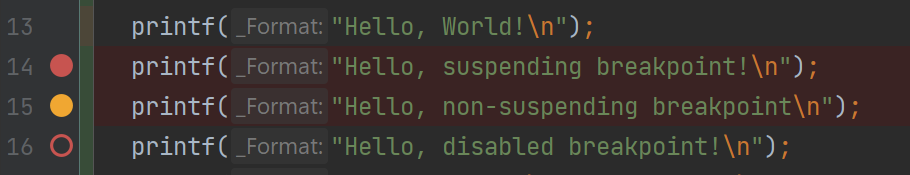

---

##### Debugger: während Pausierung

- Variablen: Werte ändern, zur Deklaration springen
- Ausdrücke auswerten
- Ausdrücke/Variablen beobachten
- Speicher inspizieren

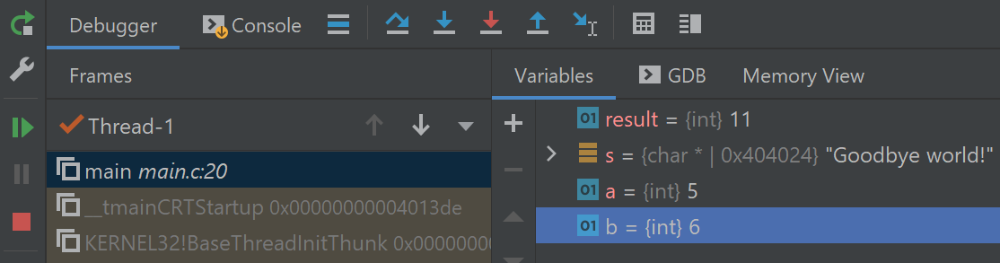

---

### Live-Übung: Debugging

<!-- _backgroundColor: #fec7e2  -->

---

### Testing & Debugging: sonstige Ressourcen

<!-- _backgroundColor: lightblue -->

- Kapitel "Testgetriebene Entwicklung" in "Agile Entwicklungspraktiken mit Scrum"
  <https://hds.hebis.de/hlbfu/Record/HEB261342312> (HLB)

- <https://www.jetbrains.com/help/clion/debugging-code.html>
  <https://www.jetbrains.com/help/idea/debugging-code.html>
  Debugging Informationen zu CLion und IntelliJ IDEA

---

## Woche 11


<!-- _backgroundColor: #f7eda8 -->

Clean Code

---

### Mögliche Probleme mit Code

1. nicht lesbar
   - Überraschungsmomente und Verständnisprobleme
2. nicht wartbar
   - Änderungen erfordern Anpassungen an vielen Stellen
3. nicht testbar
   - alles hängt mit allem zusammen

---

### Gründe für Probleme mit Code

- keine Zeit
  - "Das Feature brauch ich bis Freitag!"
  - "Der Code ist durcheinander, aber da kann ich mich jetzt nicht drum kümmern."
- nicht in die Architektur passende Änderungen
- veraltete Praktiken oder Sprachen
- nicht länger gepflegte Libraries / Frameworks

---

### Boy Scout Rule

"Leave the campground cleaner than you found it."

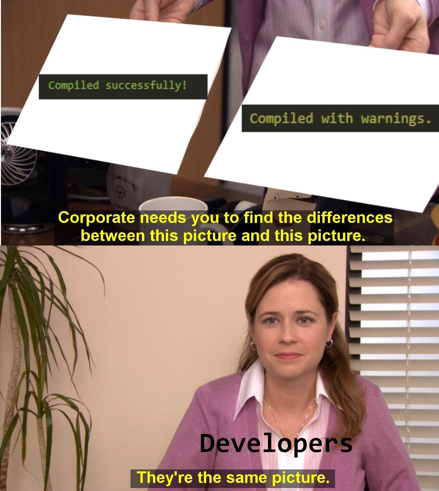

---

### Namen

Variablen, Methoden, Klassen, Pakete, Parameter,...

- eindeutig beschreibend
- unterscheidbar
- aussprechbar
- suchbar

Beispiel: Fortschritt des Downloads in Prozent
`downloadProgressInPercent` vs. `goal`, `progress`, `dpip`, `d`, `50`...

---

### Kommentare

- selbsterklärender Code benötigt keine Kommentare
  - keine Wiederholungen
  - kein Palaver
- auskommentierten Code nicht einchecken
- sinnvolle Kommentare:
  - warnen vor Nicht-Offensichtlichem
  - erklären die Absicht
  - verdeutlichen Unklarheiten

---

### Magische Werte

```C
double price = 50 * 1.19;
```

```C
double VAT_GERMANY = 0.19;
double netValue = 50;

double price = netValue * (1 + VAT_GERMANY);
```

---

### Technical Debt


- fehlerhafte / veraltete Dokumentation
- keine Infrastruktur (z.B. VCS, Backups)
- keine Coding/Style Standards
- _// TODO_ all over the place
- keine (grünen) Tests
- ignorieren von Warnings/Errors
- allgemein: "Quick/Cheap Fixes" (siehe Abbildung)

---

### weitere "Code Smells"

- träge: eine Änderung erfordert viele Folgeänderungen
- anfällig: eine Änderung verursacht Fehler an anderen Stellen
- unbeweglich: Teile des Codes können nicht in anderen Projekten wiederverwendet werden

---

### Refactoring

---

### Premature Optimization

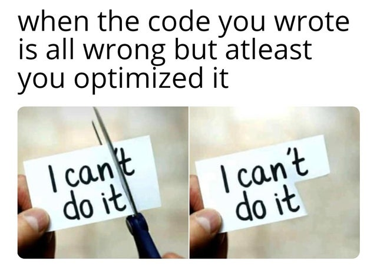

- Wie groß ist die Auswirkung der Optimierung an dieser Stelle? (siehe [Amdahlsches Gesetz](https://de.wikipedia.org/wiki/Amdahlsches_Gesetz))
- Wird die Optimierung bald obsolet?
- Ist der Aufwand der Optimierung höher als der Ertrag?

---

### YAGNI

"You ain't gonna need it."

The best code is no code / code you don't have to maintain.

---

### Dotfiles

Remote configuration files

Setup your machine faster

---

## Woche 12

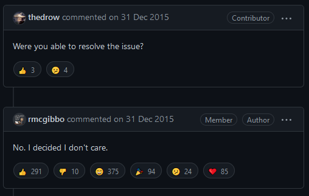

<!-- _backgroundColor: #f7eda8 -->

<!-- _footer: '[Source](https://github.com/pypa/twine/issues/153)' -->

Wiederholung / Projekt

---

## Woche 13


<!-- _backgroundColor: #f7eda8 -->

Free and Open Source Software

<!-- _footer: '[Source](http://www.modernhumorist.com/mh/0004/propaganda/mp3.php)' -->
